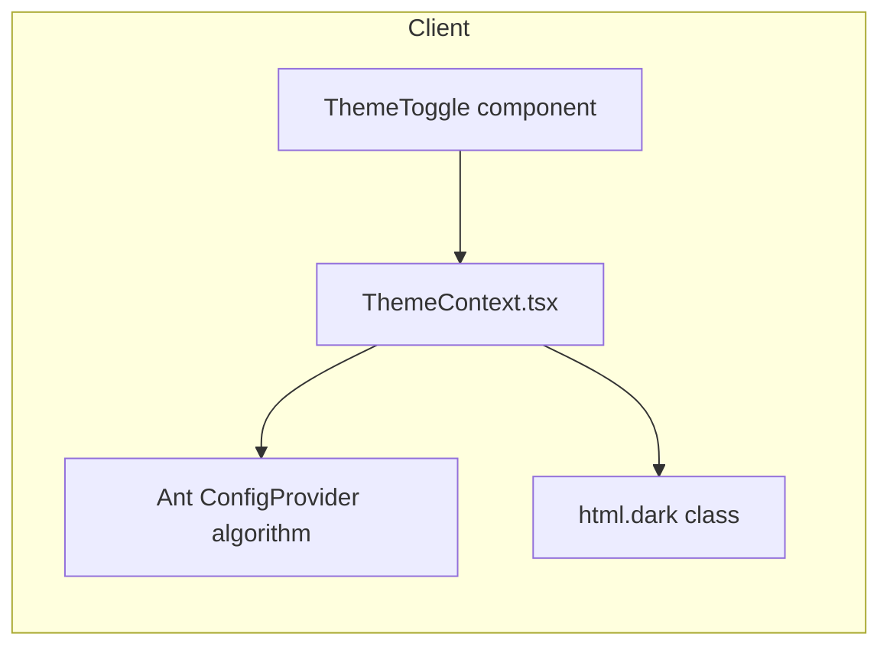

# System Architecture — ARKA MineOps

**Last Updated**: 2026-07-25

## Project Overview

Integrated mining operations dashboard for PT. Arkananta. Unifies daily production (DPR), fuel, equipment deployment, and site info into a real-time web application with procurement KPIs from ARK-GS.

## Technology Stack

- **Frontend**: React 18 + TypeScript + Inertia.js v2 + Ant Design 5 + @ant-design/charts + @tanstack/react-query + vite-plugin-pwa + Tailwind CSS (class-based dark mode)
- **Backend**: Laravel 13 + PHP 8.5 + MySQL 8 + Redis + Horizon
- **Auth**: Laravel Breeze + Spatie Permission + Sanctum (SPA stateful API); login accepts email or username

## Theming

Global dark/light mode toggle (default: **dark**), persisted in `localStorage` (`theme` key).



- **Ant Design**: `theme.darkAlgorithm` / `theme.defaultAlgorithm` in [resources/js/app.tsx](resources/js/app.tsx)
- **Tailwind**: `darkMode: 'class'` in [tailwind.config.js](tailwind.config.js)
- **No-flash**: inline script in [resources/views/app.blade.php](resources/views/app.blade.php) applies `dark` class before hydration
- **Toggle placement**: `AuthenticatedLayout` header + login page

## Authentication UI

Login page ([resources/js/Pages/Auth/Login.tsx](resources/js/Pages/Auth/Login.tsx)): split-screen branded layout (gradient brand panel + Ant Design form card). Single `login` field accepts email or username; backend resolves field in [app/Http/Requests/Auth/LoginRequest.php](app/Http/Requests/Auth/LoginRequest.php).

Users table includes optional unique `username` column (nullable; admins set via Master Data > Pengguna).

- **Integrations**: arkfleet-next (equipment API), ARK-GS (procurement API)

## Core Modules

| Module | Routes | Status |
|--------|--------|--------|
| Master Data | `/sites`, `/pits`, `/shifts`, `/fuel-types`, `/equipment-assignments` | ✅ |
| Daily Entry | `/daily-entries`, `/excel-imports` | ✅ |
| Dashboard | `/dashboard`, `/api/dashboard/*` | ✅ |
| Reports | `/reports`, `/reports/consolidated` | ✅ |
| Plan vs Actual | `/monthly-plans`, `/variance` | ✅ |
| Procurement | `/procurement`, `/api/procurement/*` | ✅ |
| Notifications | `/notifications` + scheduled commands | ✅ |
| PWA/Offline | IndexedDB + `/api/sync/*` | ✅ |

## Services

- **CalculationService** — MTD/YTD/PTD, SR, FCR, Achievement %; Redis cache with invalidation on approve
- **DailyEntryService** — CRUD orchestration, UUID idempotency, workflow
- **DashboardService** — KPI/trend/utilization aggregation
- **PlanService** — Monthly plans, variance, loss contribution
- **ProcurementApiService** — ARK-GS HTTP client, 6h Redis cache, mock fallback
- **ReportService** — PDF (dompdf) + Excel exports; consolidated multi-site/period report (production + fuel + deployment + site info)
- **EquipmentApiService** — arkfleet-next with local fallback
- **AnomalyDetectionService** — FCR outlier detection (2σ)
- **AiInsightService** — OpenRouter optional narrative

## Database (20 tables)

Core: `sites`, `pits`, `shifts`, `daily_entries`, `production_records`, `fuel_records`, `equipment_deployments`, `site_info`, `monthly_plans`, `plan_targets`, `equipment_assignments`, `project_site_mappings`, `import_batches`, `notifications`

## API Endpoints

```
GET  /api/dashboard/kpi|trend|utilization|per-pit|drilldown|fuel-by-equipment|consolidated
GET  /api/procurement/po-sent|grpo|npi|budget|all-projects
POST /api/sync/daily-entries
GET  /api/sync/status
GET  /api/variance/data
```

## Workflow

```
draft → submit → approve
```

Child records (production/fuel/deployment/site-info) saved via PUT per tab. Calculation cache invalidated on approve.

## Scheduled Commands

- `07:00 WITA` — `mineops:send-daily-summary`
- `20:00 WITA` — `mineops:send-entry-reminder`
- Hourly :30 (07–18) — `mineops:check-achievement`, `mineops:check-fuel-anomaly`

## PWA

vite-plugin-pwa with `registerType: autoUpdate`. IndexedDB stores (`draftEntries`, `syncQueue`) via `idb`. Idempotent sync by UUID.
