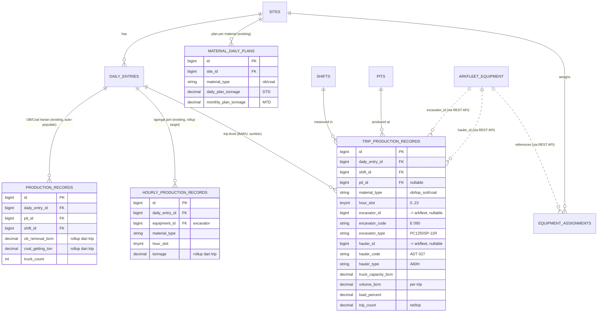
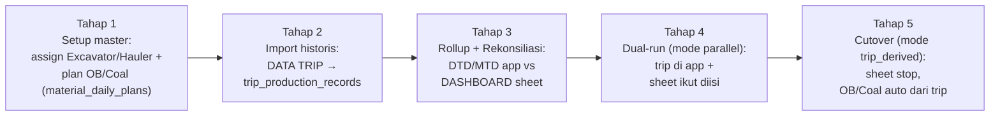

# ARKA MineOps — Konsep CCR 022C (Coal Project, Trip-Level)

> **Dokumen Konsep** · Ekstensi modul `MO-Hourly` (CCR) untuk format **022C GPK — Coal Project**
> PT. Arkananta · Site **022C** (pola extensible ke site coal lain: 017C KPUC, 011C Kitadin)
> Versi 0.1 · Status: Draft konsep (belum coding)
> Tujuan: menyerap **CCR 022C** (14 sheet, 8.006 baris trip) ke dalam ARKA MineOps sebagai **stream trip-level**, **mengekstensi** modul CCR Hourly yang sudah jalan — bukan modul baru terpisah.

---

## 0. Ringkasan Eksekutif

CCR 022C adalah **format CCR ketiga**. Dua yang sudah live:

- **CCR 021C/025C** (`MO-Hourly`) — agregat **per jam per alat** untuk Limestone/Shalestone (Mton), tersimpan di `hourly_production_records`.

022C berbeda fundamental: datanya **trip-level** — **satu baris = satu ritase truk**. Setiap trip membawa pasangan **Excavator (digger) × Hauler (truk)**, kapasitas truk, volume/trip (BCM), % load, dan ret/trip. Material: **OB (Overburden)**, **Top Soil**, **Coal**. Volume harian ~250+ baris (8.006 total/bulan).

**Prinsip desain (sama seperti add-on hourly):** *reuse maksimal, schema minimal, extend jangan duplikat.*

Insight kunci: 022C **bukan** modul baru — ia adalah **lapisan sumber yang lebih granular** di bawah infrastruktur yang sudah ada. Alur data:

```
DATA TRIP (trip-level, BARU)  →  hourly_production_records (existing)  →  CalculationService DTD/MTD (existing)  →  Dashboard/Heatmap (existing)
                              ↘  production_records OB/Coal (existing, auto-populate)  →  Dashboard Executive (existing)
```

| Yang di-reuse (sudah ada) | Yang ditambah (baru) |
|---------------------------|----------------------|
| `daily_entries` header harian (unik `production_date` + `site_id`) | Tabel `trip_production_records` (inti trip-level) |
| `hourly_production_records` sebagai **agregat jam** (tujuan rollup dari trip) | Enum `MaterialType::TopSoil` (OB & Coal sudah ada) |
| `material_daily_plans` (plan DTD/MTD per material) | `TripProductionService` (upsert trip + rollup ke hourly & daily) |
| `production_records` (OB Bcm / Coal ton harian) sebagai target auto-populate | Kolom pairing di `equipment_assignments` (`equipment_role: excavator/hauler`) |
| `CalculationService::materialDtd/materialMtd/hourlyTarget` (tak berubah) | Method `TripAggregationService` (trip → hourly → daily) |
| `EquipmentAssignment` + arkfleet-next (registry `E 090`, `ADT 027`, …) | View pairing Excavator×Hauler (derived, tidak disimpan) |
| Workflow draft→submit→approve, PWA, `import_batches` | CCR 022C importer (14-sheet, DATA TRIP → trip records) |

Hasil: 022C menjadi **sumber kebenaran trip-level** yang **memberi makan** dashboard OB/Coal existing dan heatmap CCR existing — tanpa mengubah keduanya. Nilai hourly & daily menjadi **derived** dari trip, menghilangkan double-entry.

---

## 1. Analisis — 022C vs Modul yang Sudah Ada

### 1.1 Tiga stream produksi dalam MineOps

| Stream | Tabel | Granularitas | Satuan | Contoh site |
|--------|-------|--------------|--------|-------------|
| Daily Production (existing) | `production_records` | Hari × pit × shift | OB Bcm, Coal ton | Semua site |
| CCR Hourly (existing) | `hourly_production_records` | Jam × alat × material | Mton | 021C, 025C |
| **CCR Trip (022C, BARU)** | **`trip_production_records`** | **Trip (ritase)** | **BCM/trip, → Mton coal** | **022C** |

### 1.2 Perbedaan 022C vs CCR Hourly 021C/025C

| Dimensi | CCR 021C/025C | CCR 022C |
|---------|---------------|----------|
| Granularitas | Agregat **per jam** (1 sel = Σ tonase jam itu) | **Per trip** (1 baris = 1 ritase truk) |
| Material | Limestone, Shalestone | **OB, Top Soil, Coal** |
| Poros aset | 1 alat (excavator output/jam) | **Pasangan Excavator × Hauler** per trip |
| Data ekstra | — | Truck capacity, % load, ret/trip, volume/trip |
| Volume | ~24 baris/hari | **~250+ baris/hari** (8.006/bulan) |
| Satuan | Mton | BCM (OB/Top Soil), Mton (Coal via densitas) |

### 1.3 Perbedaan 022C vs Daily Production (existing)

Site 022C **sudah** mencatat OB/Coal harian di `production_records` lewat Daily Entry biasa. CCR trip **lebih granular** dari itu. Relasinya (dijelaskan di §3.4): trip menjadi **sumber** yang **meng-agregat naik** menjadi `production_records` — bukan tabel saingan.

**Insight kunci:** 022C bertemu skema existing di entitas yang **sudah ada** — `daily_entries`, `shifts`, `equipment` (arkfleet), `MaterialType`, dan **tabel target agregat `hourly_production_records` + `production_records`**. Yang benar-benar baru hanya **granularitas trip** dan **pasangan excavator-hauler**.

---

## 2. Data Model

### 2.1 Enum — tambah `TopSoil`

`MaterialType` sudah punya `Overburden` & `Coal` (dipakai 017C). Cukup tambah satu case:

```php
// app/Enums/MaterialType.php
case TopSoil = 'top_soil';

// label(): self::TopSoil => 'Top Soil (TS)',
```

### 2.2 Tabel inti — `trip_production_records`

**Satu baris = satu ritase truk.** Menempel ke `daily_entries` yang sudah ada (tidak ada header baru). Menyimpan pasangan Excavator×Hauler + atribut trip.

```php
Schema::create('trip_production_records', function (Blueprint $table) {
    $table->id();
    $table->foreignId('daily_entry_id')->constrained()->cascadeOnDelete(); // reuse header harian
    $table->foreignId('shift_id')->constrained()->cascadeOnDelete();
    $table->foreignId('pit_id')->nullable()->constrained()->nullOnDelete();
    $table->string('material_type');                 // MaterialType: ob | top_soil | coal
    $table->unsignedTinyInteger('hour_slot');        // 0..23 = jam mulai interval (WIB lokal 022C)

    // Excavator (digger) — ref arkfleet-next, unit_code & type di-cache (pola fuel/deployment)
    $table->unsignedBigInteger('excavator_id')->nullable();  // ref arkfleet equipment.id
    $table->string('excavator_code')->nullable();            // "E 090"
    $table->string('excavator_type')->nullable();            // "PC1250SP-11R" (cache)

    // Hauler (truk) — ref arkfleet-next
    $table->unsignedBigInteger('hauler_id')->nullable();     // ref arkfleet equipment.id
    $table->string('hauler_code')->nullable();               // "ADT 027", "RD 038"
    $table->string('hauler_type')->nullable();               // "A60H", "740 GC" (cache)

    // Atribut trip
    $table->decimal('truck_capacity_bcm', 6, 2)->nullable(); // 16.50–24.00
    $table->decimal('volume_bcm', 10, 2)->default(0);        // volume trip (BCM); coal → Mton via densitas saat rollup
    $table->decimal('load_percent', 5, 2)->nullable();       // % load
    $table->decimal('trip_count', 4, 1)->default(1);         // ret/trip 1.0–5.0
    $table->string('location')->nullable();                  // front/lokasi loading

    $table->timestamps();

    // Idempoten import/sync: baris trip unik per pasangan+jam+urutan ritase
    $table->unique(
        ['daily_entry_id', 'excavator_code', 'hauler_code', 'hour_slot', 'trip_count'],
        'trip_unique_slot'
    );
    $table->index(['daily_entry_id', 'material_type', 'hour_slot']);
    $table->index(['excavator_id', 'hauler_id']);       // pairing view
    $table->index(['daily_entry_id', 'pit_id', 'shift_id']); // rollup → production_records
});
```

**Catatan desain:**
- `hour_slot` = jam mulai interval (0–23) dalam **wall-clock lokal 022C (WIB)** — konsisten dengan `hourly_production_records` (interval `[h, h+1)`, timezone dicatat per site).
- **Satuan:** `volume_bcm` = ukuran native trip (BCM) untuk OB/Top Soil. Coal dikonversi ke **Mton** saat rollup memakai `density_factor` (dari `EQUIP DATA`/config site) — konsisten dengan angka DASHBOARD 022C (Coal Mton).
- `excavator_id`/`hauler_id` nullable → import tetap jalan bila unit belum ter-match ke arkfleet; `*_code`/`*_type` di-cache lokal (denormalized, pola `fuel_records`) → view pairing & report tak perlu API call per render.
- `trip_count` (ret/trip) masuk `unique` agar beberapa ritase pada jam & pasangan yang sama tidak saling menimpa; idempoten untuk import/PWA sync.
- **Tanpa kolom agregat** (Σ jam, DTD, MTD, % achievement) — semua **derived** (Calculation Engine terpusat).

### 2.3 Perubahan minor pada tabel existing

1. **`equipment_assignments`** — `equipment_role` sudah ada (loader/hauler/grader dari add-on hourly). Untuk 022C tinggal **memakai nilai** `excavator` (digger) dan `hauler`. Tidak perlu ALTER tabel; cukup pilihan role baru di modal **Klasifikasi CCR** yang sudah ada. `display_order` dipakai untuk urutan kolom heatmap OB (E 090, E 092, E 071, E 091).

2. **`sites`** — tambahkan (opsional) `coal_density_factor` decimal untuk konversi BCM→Mton coal, atau simpan di `config/mineops.php` per site. Bila belum ada, pakai default & catat di `MEMORY.md`.

> Tidak ada tabel plan baru: **`material_daily_plans`** sudah menampung DTD/MTD per material (OB & Coal) — cukup isi baris untuk 022C (Plan OB 1.000.000 BCM/bln, Coal 300.000 Mton/bln, dst.).

---

## 3. Integration Strategy

### 3.1 Reuse `daily_entries` (pola identik hourly)

Satu hari di 022C = satu `daily_entry` (unik `production_date` + `site_id`). Entry yang sama menampung **trip records (baru)**, **hourly records (rollup)**, **production records (OB/Coal harian)**, fuel, deployment — semua child terpisah, tidak konflik. Workflow draft→submit→approve **tidak berubah**.

### 3.2 Agregasi berlapis: Trip → Hourly → Daily → MTD

Inti strategi: **trip adalah sumber; agregat naik adalah derived**. Setiap kali trip disimpan/approve, `TripAggregationService` melakukan rollup **idempoten** (replace-per-entry) ke dua target existing:

**(a) Trip → `hourly_production_records`** (untuk Heatmap & CalculationService):
- Group trip per `(excavator_id, material_type, hour_slot, shift_id)`.
- `tonnage` = Σ `volume_bcm` (OB/Top Soil) atau Σ (`volume_bcm × density`) untuk Coal (→ Mton).
- Tulis/replace baris `hourly_production_records` → **DTD/MTD/hourlyTarget/heatmap existing langsung jalan tanpa ubah kode** (`CalculationService::materialDtd/materialMtd` sudah menjumlah `hourly_production_records.tonnage`).

**(b) Trip → `production_records`** (untuk Dashboard Executive OB/Coal):
- Group trip per `(pit_id, shift_id)`.
- `ob_removal_bcm` = Σ OB volume; `coal_getting_ton` = Σ coal Mton; `truck_count` = jumlah ritase (Σ `trip_count`).
- Auto-populate `production_records` → KPI OB/Coal/SR existing terisi otomatis (lihat §3.4).

```
                     ┌─────────────────────────────┐
   DATA TRIP  ──────▶│  TripAggregationService     │
 (trip_production)   │  (idempotent, per entry)    │
                     └─────────────┬───────────────┘
                       (a) per     │      (b) per
                 excavator×mat×jam │      pit×shift
                                   ▼               ▼
                 hourly_production_records   production_records
                       │                          │
              materialDtd/Mtd,            ob_removal_bcm, coal_getting_ton
              hourlyTarget, Heatmap        SR, MTD, Achievement (existing)
```

### 3.3 Pelacakan pasangan Excavator × Hauler (derived)

View pairing = agregasi `trip_production_records` group by `(excavator_id, hauler_id)` → jumlah trip, Σ volume, rata-rata % load, rata-rata ret/trip. **Tidak disimpan** — dihitung on-demand, cache Redis pola `CalculationService`. Menjawab pertanyaan operasional: "Truk mana melayani digger mana, seberapa produktif?"

### 3.4 Hubungan dengan `production_records` (OB/Coal harian) — dua mode

022C daily OB/Coal **sudah** ada di `production_records`. Konsep menawarkan **feature flag per site** (`sites.production_source` atau `config/mineops.php`):

| Mode | Perilaku | Kapan |
|------|----------|-------|
| **`trip_derived`** (rekomendasi akhir) | `production_records` OB/Coal **auto-populate** dari rollup trip (§3.2b). Daily Entry OB/Coal jadi read-only (hasil kalkulasi). | Setelah trip data dipercaya (pasca dual-run) |
| **`parallel`** (transisi) | Trip data untuk analisis granular; OB/Coal harian tetap diinput manual di Daily Entry. Sistem **rekonsiliasi** (Σ trip vs manual) menandai selisih. | Selama dual-run |

Prinsip: **satu sumber kebenaran akhirnya** (trip), tapi migrasi bertahap lewat mode `parallel` dulu agar aman. Ini konsisten dengan pola feature-flag `production_mode` yang sudah dipakai site CCR.

### 3.5 Calculation & Service (reuse + tambah rollup)

- **`CalculationService`** — **tidak berubah**. `materialDtd/materialMtd/hourlyTarget/achievement` sudah beroperasi atas `hourly_production_records`; karena trip me-rollup ke sana, DTD OB (24.244,5 BCM), MTD Coal (246.757,76 Mton), dst. otomatis benar. Invalidasi cache saat approve tetap dipakai.
- **`TripProductionService`** (baru) — orkestrasi CRUD/import baris trip per (tanggal, site, material, shift), idempotency via `daily_entries.uuid` + `unique(...)`. Analog `HourlyProductionService`.
- **`TripAggregationService`** (baru) — rollup trip → hourly & daily (§3.2), dipanggil saat submit/approve; idempoten replace.
- **Dashboard/Report/Notify** — reuse endpoint & scheduled command existing; tambah endpoint pairing.

---

## 4. ERD — Relasi dengan Skema Existing

Kotak abu-abu = existing (tak berubah); **tebal** = baru; garis putus-putus = ref eksternal via REST API (arkfleet-next).



**Poin integrasi:** `trip_production_records` menggantung pada `daily_entries` yang **sama**, dan **memberi makan** dua tabel agregat existing (`hourly_production_records`, `production_records`) lewat rollup. Tidak ada tabel yang di-refactor; semua yang existing tetap utuh.

---

## 5. UI Concept

### 5.1 Dashboard 022C (Desktop) — extend `hourly/Dashboard.tsx`

```
┌──────────────────────────────────────────────────────────────────────────────┐
│ ARKA MineOps  Site:[022C GPK ▼]  📅 31 Jul 2026   ⏱ Jam berjalan: 14:00–15:00  │
├──────────────────────────────────────────────────────────────────────────────┤
│  OVERBURDEN (OB, BCM)              COAL (Mton)               TOP SOIL (BCM)     │
│ ┌───────────┬───────────┐        ┌───────────┬───────────┐  ┌───────────┐      │
│ │ DTD       │ MTD       │        │ DTD       │ MTD       │  │ DTD       │      │
│ │ 24.244,5  │ 914.381,5 │        │ 5.935,76  │ 246.757,76│  │ 1.240     │      │
│ │ /33.483   │ /1.000.000│        │ /10.591   │ /300.000  │  │ —         │      │
│ │ ▼ 72,4%   │ ▲ 91,4%   │        │ ▼ 56,0%   │ ▲ 82,3%   │  │           │      │
│ └───────────┴───────────┘        └───────────┴───────────┘  └───────────┘      │
│                                                                                │
│  HEATMAP OB — PER JAM × EXCAVATOR (Day Shift)          [OB|Coal|TS] [export]    │
│  ┌────────────┬──────┬──────┬──────┬──────╥──────────┐                          │
│  │ Jam (WIB)  │E 090 │E 092 │E 071 │E 091 ║ D/Shift  │                          │
│  ├────────────┼──────┼──────┼──────┼──────╫──────────┤                          │
│  │06:00–07:00 │ 620🟩│ 480🟨│ 510🟩│ 300🟥║  1.910   │                          │
│  │07:00–08:00 │ 580🟩│ 520🟩│ 210🟥│ 640🟩║  1.950   │                          │
│  │    …       │  …   │  …   │  …   │  …   ║    …     │                          │
│  │ TOTAL      │6.240 │5.055 │4.980 │3.890 ║ 24.244,5 │                          │
│  └────────────┴──────┴──────┴──────┴──────╨──────────┘                          │
│  Skala: 🟥 <70% target/jam  🟨 70–95%  🟩 ≥95%                                  │
│                                                                                │
│  ┌────────────────────────────────┐┌────────────────────────────────────────┐ │
│  │ PAIRING EXCAVATOR × HAULER      ││ FLEET STATUS (equipment_assignments)    │ │
│  │ E 090 ▸ ADT 001,003,027 (18 rit)││ Excavator OB ● 4   Coal ● 2-3           │ │
│  │ E 092 ▸ ADT 011,014 (12 rit)    ││ Hauler ● A60H×6 HM400×4 740GC×3 A40G×2  │ │
│  │ avg %load 96%  avg ret/trip 3,2 ││ 773E×2   Breakdown ● 1                  │ │
│  └────────────────────────────────┘└────────────────────────────────────────┘ │
└──────────────────────────────────────────────────────────────────────────────┘
```

- **KPI cards** OB/Coal/Top Soil (DTD/MTD) — reuse komponen card material existing; sumber angka = `materialDtd/materialMtd` (tak berubah karena rollup).
- **Heatmap** = AntD Table cell-render berwarna `tonnage / hourlyTarget` — **komponen heatmap existing dipakai apa adanya**, cukup material `ob`/`coal`/`top_soil`.
- **Pairing panel** (baru) = tabel/tree Excavator→Hauler (derived §3.3).
- **Fleet status** = dari `equipment_assignments` (`equipment_role`), reuse `getFleetStatus`.

### 5.2 Input — dua jalur

**Jalur utama: Import Excel 022C** (realistis untuk 8.006 baris) — reuse pipeline `import_batches`:

```
┌──────────────────────────────────────────────────────────────┐
│ Import CCR 022C — 31 Jul 2026 · 022C          [Pilih file ▼]  │
├──────────────────────────────────────────────────────────────┤
│ Sheet terdeteksi: DATA TRIP (8.006 baris) ✓                   │
│ Preview mapping:                                              │
│  Excavator Type→excavator_type  Digger code→excavator_code    │
│  Hauler Type→hauler_type  Hauler code→hauler_code             │
│  Volume(BCM)→volume_bcm  %Load→load_percent  Ret/Trip→trip_cnt│
│ ⚠ 12 unit code belum match arkfleet → [Review]               │
│ ⚠ 3 baris material kosong → [Skip/Perbaiki]                   │
│ Rollup preview: DTD OB 24.244,5 · Coal 5.935,76 (cocok sheet) │
│                                   [Batal] [Import & Rollup]   │
└──────────────────────────────────────────────────────────────┘
```

**Jalur manual (opsional): entry trip cepat** — form pendek per ritase (mobile/CCR), keyboard numerik, tombol besar; dropdown Excavator & Hauler dari `equipment_assignments`. Untuk koreksi/tambahan, bukan bulk.

### 5.3 Mobile (Supervisor/CCR 022C)

Layar ringkas: progres DTD OB/Coal (bar + %), daftar jam terakhir, tombol "+ Tambah trip" (pilih Excavator → Hauler → volume → jam). PWA offline: draft trip di IndexedDB, sync idempoten via `daily_entries.uuid` + `unique(...)`.

---

## 6. Fase Implementasi (H0–H3, ± 2–3 minggu)

> Ekstensi di atas modul CCR Hourly yang sudah production-ready. Estimasi 1–2 developer.

- **Fase H0 — Data model & rollup engine (3–4 hari):**
  `MaterialType::TopSoil`; migration `trip_production_records` + model `TripProductionRecord` (relasi `belongsTo DailyEntry/Shift/Pit`); `sites.coal_density_factor` (atau config); `TripAggregationService` (trip → hourly & daily, idempoten) + unit test rollup (DTD OB/Coal harus match angka DASHBOARD 022C).
  *Deliverable:* `migrate --pretend` OK, rollup teruji.

- **Fase H1 — Import 022C & pairing (4–5 hari):**
  `TripProductionService` + importer sheet DATA TRIP (reuse `import_batches`, match `*_code`→arkfleet, preview + human-in-the-loop + flag anomali); endpoint pairing (derived + cache). Tests: import idempoten, pairing agregat.
  *Deliverable:* import 8.006 baris → rollup → angka rekonsiliasi cocok.

- **Fase H2 — Dashboard & heatmap 022C (4–5 hari):**
  Extend `hourly/Dashboard.tsx`: KPI OB/Coal/Top Soil, heatmap per excavator (reuse), panel pairing, fleet status. Feature flag site `022C` (sudah di `config/mineops.php`).
  *Deliverable:* dashboard 022C live dari trip data.

- **Fase H3 — Mode trip-derived, entry manual & PWA (3–4 hari):**
  Feature flag `production_source` (parallel ↔ trip_derived) + auto-populate `production_records`; rekonsiliasi Σtrip vs manual; form entry trip manual + PWA offline; export "CCR 022C Daily".
  *Deliverable:* siap dual-run & cutover.

**Total:** ± **2–3 minggu** untuk paritas penuh dengan Excel CCR 022C.

---

## 7. Migration Path — Excel 022C → MineOps

Strategi **dual-run** (paralel, bukan big-bang), standar proyek.



1. **Setup:** assign Excavator (`E 090`…) role `excavator` + Hauler (`ADT 027`, `RD 038`…) role `hauler` ke 022C via **Klasifikasi CCR** (existing); isi `material_daily_plans` OB & Coal dari sheet DATA PLAN / MONTHLY PLAN (DTD, MTD, operating hours); set `coal_density_factor`.
2. **Import historis:** importer baca **DATA TRIP**; map kolom → field trip; match `*_code`→arkfleet; buat/temukan `daily_entry` per tanggal; preview + flag anomali (reuse `import_batches`).
3. **Rollup + Rekonsiliasi:** jalankan `TripAggregationService`; bandingkan **DTD OB/Coal & MTD hasil app** vs **DASHBOARD NEW** sheet (mis. DTD OB 24.244,5 BCM = 72,4%; MTD Coal 246.757,76 Mton = 82,3%) sebagai QA — harus match.
4. **Dual-run** (mode `parallel`) 1–2 bulan: operator import/entri di app; sheet tetap diisi sebagai pembanding.
5. **Cutover** (mode `trip_derived`): sheet dihentikan; `production_records` OB/Coal auto dari trip; app single source of truth; export "CCR 022C Daily" menggantikan distribusi sheet.

**Pemetaan sheet → field (ringkas):**

| Sumber (Sheet 022C) | Target (MineOps) |
|---------------------|------------------|
| **DATA TRIP** (8.006 baris) | `trip_production_records` (semua atribut trip) |
| **DASHBOARD NEW** (DTD/MTD OB & Coal, Achievement) | `material_daily_plans` (plan) + **derived** `CalculationService` (actual/achievement) |
| **DATA PLAN / MONTHLY PLAN** | `material_daily_plans.daily_plan_tonnage/monthly_plan_tonnage/operating_hours_per_day` |
| **DATA HOURLY** (ringkasan jam) | **derived** dari rollup trip → `hourly_production_records` |
| **DATA DAILY** (fleet availability) | dihitung dari `equipment_assignments` (`equipment_role`) |
| **EQUIP DATA** (kapasitas, densitas) | cache `truck_capacity_bcm`, `sites.coal_density_factor` |
| **Rain & Slippery Hours** | (opsional Fase lanjut) — hilang-jam produksi; bisa numpang `site_info`/notes |
| **RESUME / DATA BASE** | referensi QA saja (tidak di-import mentah) |

---

## 8. Keputusan & Trade-off Kunci

| Keputusan | Alasan |
|-----------|--------|
| Trip sebagai **sumber**, hourly & daily sebagai **derived** (rollup) | Menghilangkan double-entry; dashboard/heatmap/executive existing jalan tanpa ubah kode |
| Extend modul `MO-Hourly`, bukan modul baru | 022C sudah jadi CCR site di `config/mineops.php`; reuse `daily_entries`, `material_daily_plans`, heatmap, CalculationService |
| **Dua** FK equipment (excavator_id + hauler_id) di satu baris trip | Pasangan Excavator×Hauler adalah inti 022C; memungkinkan pairing view (derived) |
| Rollup ke `hourly_production_records` (bukan query trip langsung di dashboard) | `CalculationService::materialDtd/Mtd` sudah baca tabel itu → **nol perubahan** di engine & dashboard |
| Auto-populate `production_records` via feature flag (parallel → trip_derived) | Migrasi aman; hindari big-bang; akhirnya satu sumber kebenaran |
| `volume_bcm` native + konversi coal via `density_factor` saat rollup | Cocokkan angka DASHBOARD (OB BCM, Coal Mton) tanpa menyimpan agregat ganda |
| Import-first (bukan manual entry) untuk 8.006 baris | Volume trip terlalu besar untuk input tangan; reuse `import_batches` pipeline |
| Agregat (DTD/MTD/Achievement/pairing/D-Shift) **derived**, tak disimpan | Konsisten Calculation Engine terpusat (decisions.md) → angka selalu sinkron |
| Equipment tetap via arkfleet-next + cache `*_code`/`*_type` | Pola existing; no duplikasi master fleet; import tahan bila belum match |

---

*Dokumen konsep untuk didiskusikan sebelum fase teknis. Setelah disepakati: buat migration via `php artisan make:*`, tambah `MaterialType::TopSoil`, `TripProductionService` + `TripAggregationService`, lalu update `docs/architecture.md`, `docs/decisions.md`, `docs/todo.md`, `MEMORY.md`.*
