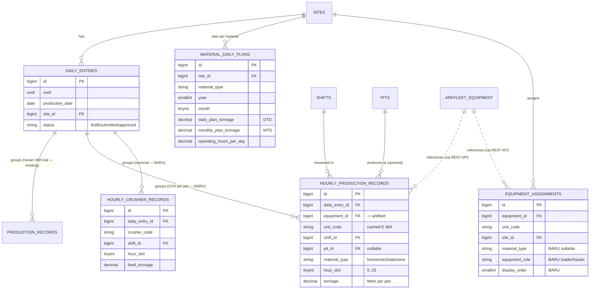
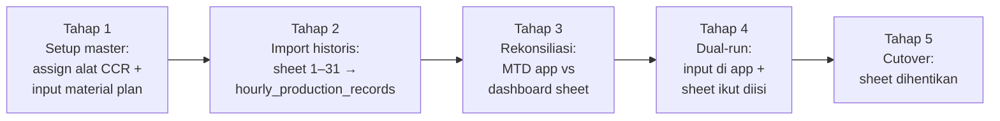

# ARKA MineOps — Konsep Hourly Production Monitoring (CCR)

> **Dokumen Konsep** · Add-on modul `MO-Hourly` (CCR — Continuous Control Room)
> PT. Arkananta · Site **021C SBI** & **025C** (extensible ke site lain)
> Versi 0.1 · Status: Draft konsep (belum coding)
> Tujuan: menggantikan **2 Google Sheets CCR** (021C & 025C) dengan modul hourly di dalam ARKA MineOps, memanfaatkan skema & service yang sudah ada.

---

## 0. Ringkasan Eksekutif

CCR mencatat produksi **per jam per alat** (bukan per hari seperti DPR/Daily Info). Dua Google Sheets existing (CCR 021C untuk Limestone + Shalestone, CCR 025C untuk Limestone) berisi:

- **Dashboard** Plan vs Actual per material (DTD & MTD + Achievement %),
- **Tabel hourly** (baris = interval jam 08:00–09:00 dst., kolom = alat `E 084`, `E 096`, …, sel = tonase), color-coded merah→hijau,
- **Fleet summary** (jumlah unit loader/hauler/grader).

**Prinsip desain add-on ini:** *reuse maksimal, schema minimal.*

| Yang di-reuse (sudah ada) | Yang ditambah (baru) |
|---------------------------|----------------------|
| `daily_entries` sebagai header harian (unik per `production_date` + `site_id`) | Tabel `hourly_production_records` (inti) |
| `sites`, `pits`, `shifts` | Tabel `material_daily_plans` (plan DTD/MTD + per-jam) |
| `equipment_assignments` + arkfleet-next API (equipment) | Enum `MaterialType` (limestone/shalestone/…) |
| `CalculationService` (pola MTD + Redis cache + invalidasi saat approve) | (opsional) `hourly_crusher_records`, kolom `material_type` di `equipment_assignments` |
| Draft → submit → approve workflow, PWA offline, Excel import pipeline (`import_batches`) | Method material-aware di `CalculationService` + `HourlyProductionService` |

Hasil: modul hourly menjadi **stream produksi paralel berbasis material** yang menempel pada infrastruktur harian yang sudah jalan — modul OB/Coal existing **tidak berubah**.

---

## 1. Analisis Perbedaan CCR vs Modul Harian Existing

| Dimensi | Modul Harian (existing) | CCR Hourly (baru) |
|---------|-------------------------|-------------------|
| Granularitas waktu | Per hari + shift | **Per jam** (00:00–01:00 … 23:00–24:00) + shift |
| Metrik produksi | OB Removal (Bcm), Coal Getting (ton) | **Tonase material** (Mton): Limestone, Shalestone |
| Dimensi utama | `pit` × `shift` | `material` × `equipment` × `hour` |
| Poros aset | Equipment (fuel/deployment) | **Equipment per kolom** (setiap alat = 1 kolom tonase/jam) |
| Plan | OB/Coal/SR per PIT per bulan | Plan material **DTD + MTD**, diturunkan jadi target per jam |
| Visual khas | KPI card, trend line | **Heatmap** jam × alat (merah→hijau) + kolom D/Shift Mton |

**Insight kunci:** CCR bertemu modul existing di tiga entitas yang **sudah ada** — `daily_entries` (tanggal+site), `shifts`, dan `equipment` (arkfleet). Yang benar-benar baru hanya **granularitas jam** dan **dimensi material**.

---

## 2. Data Model

### 2.1 Enum baru — `MaterialType`

Mengikuti pola `ProductionActivity`/`ShiftName` yang sudah ada (backed enum + `label()` Indonesian + `options()`).

```php
<?php

namespace App\Enums;

enum MaterialType: string
{
    case Limestone = 'limestone';
    case Shalestone = 'shalestone';
    case Coal = 'coal';
    case Other = 'other';

    public function label(): string
    {
        return match ($this) {
            self::Limestone => 'Limestone (LS)',
            self::Shalestone => 'Shalestone (SH)',
            self::Coal => 'Coal',
            self::Other => 'Lainnya',
        };
    }

    /** @return array<string, string> */
    public static function options(): array
    {
        return collect(self::cases())
            ->mapWithKeys(fn (self $case) => [$case->value => $case->label()])
            ->all();
    }
}
```

### 2.2 Tabel inti — `hourly_production_records`

Menyimpan **satu baris per (alat × material × jam)** dalam satu hari — persis satu sel di Google Sheet hourly. Menempel ke `daily_entries` yang sudah ada (tidak perlu header baru).

```php
Schema::create('hourly_production_records', function (Blueprint $table) {
    $table->id();
    $table->foreignId('daily_entry_id')->constrained()->cascadeOnDelete(); // reuse header harian
    $table->unsignedBigInteger('equipment_id');          // ref arkfleet-next.equipment.id
    $table->string('unit_code')->nullable();             // cached ("E 084") — pola sama fuel/deployment
    $table->foreignId('shift_id')->constrained()->cascadeOnDelete();
    $table->foreignId('pit_id')->nullable()->constrained()->nullOnDelete(); // opsional (CCR pakai lokasi/crusher)
    $table->string('material_type');                     // MaterialType enum
    $table->unsignedTinyInteger('hour_slot');            // 0..23 = jam mulai interval (waktu lokal site)
    $table->decimal('tonnage', 14, 2)->default(0);       // Mton pada jam itu
    $table->string('location')->nullable();              // "front"/lokasi loading
    $table->string('loader_info')->nullable();           // catatan loader (dari sheet)
    $table->timestamps();

    $table->unique(['daily_entry_id', 'equipment_id', 'material_type', 'hour_slot'], 'hourly_unique_slot');
    $table->index(['daily_entry_id', 'material_type']);
    $table->index(['equipment_id', 'hour_slot']);
});
```

**Catatan desain:**
- `hour_slot` = jam mulai interval (0–23) dalam **waktu operasional lokal site**. Interval jam = `[hour_slot:00, hour_slot+1:00)`. 021C beroperasi acuan **WIB**, 025C **WITA** — nilai disimpan apa adanya (local wall-clock), timezone dicatat di config site (lihat §2.5). Ini menghindari pergeseran tanggal saat konversi.
- `unit_code` di-cache lokal (denormalized) mengikuti pola `fuel_records`/`equipment_deployments` — heatmap & report tidak perlu API call arkfleet per render.
- `unique` mencegah dobel input sel yang sama (idempoten untuk sync PWA/import).
- `daily_entries` header sudah unik `(production_date, site_id)` → otomatis membedakan 021C vs 025C dan tanggalnya.

### 2.3 Tabel plan — `material_daily_plans`

Menyimpan **DASHBOARD Plan** per material (DTD & MTD) + basis derivasi target per jam. Header plan tetap bisa mengacu `monthly_plans` yang ada, tapi CCR berbasis material (bukan pit), jadi tabel sendiri lebih bersih.

```php
Schema::create('material_daily_plans', function (Blueprint $table) {
    $table->id();
    $table->foreignId('site_id')->constrained()->cascadeOnDelete();
    $table->string('material_type');                       // MaterialType
    $table->unsignedSmallInteger('year');
    $table->unsignedTinyInteger('month');
    $table->decimal('daily_plan_tonnage', 14, 2)->default(0);   // DTD target (mis. 10.833 Mton)
    $table->decimal('monthly_plan_tonnage', 14, 2)->default(0); // MTD target (mis. 325.004 Mton)
    $table->decimal('operating_hours_per_day', 5, 2)->default(20); // basis target/jam
    $table->foreignId('created_by')->constrained('users')->cascadeOnDelete();
    $table->timestamps();

    $table->unique(['site_id', 'material_type', 'year', 'month']);
});
```

**Turunan (tidak disimpan mentah — dihitung `CalculationService`):**
- **Target per jam** = `daily_plan_tonnage / operating_hours_per_day` → dipakai untuk warna heatmap & Plan vs Actual per jam.
- **DTD Actual** = Σ `tonnage` untuk (site, material, tanggal).
- **MTD Actual** = Σ `tonnage` untuk (site, material, bulan).
- **Achievement %** = reuse `CalculationService::achievement(actual, target)`.

### 2.4 (Opsional) `hourly_crusher_records`

Sheet harian punya blok crusher ("CRUSHING CIL 1"). Bukan inti heatmap alat, jadi dipisah & opsional (Fase 2 add-on).

```php
Schema::create('hourly_crusher_records', function (Blueprint $table) {
    $table->id();
    $table->foreignId('daily_entry_id')->constrained()->cascadeOnDelete();
    $table->string('crusher_code');                 // "CRUSHING CIL 1"
    $table->foreignId('shift_id')->constrained()->cascadeOnDelete();
    $table->unsignedTinyInteger('hour_slot');
    $table->decimal('feed_tonnage', 14, 2)->default(0);
    $table->decimal('running_hours', 5, 2)->default(0);
    $table->timestamps();

    $table->unique(['daily_entry_id', 'crusher_code', 'hour_slot'], 'crusher_unique_slot');
});
```

### 2.5 Perubahan minor pada tabel existing

1. **`equipment_assignments`** — tambah kolom nullable untuk mengelompokkan alat per material & peran (agar form input tahu kolom mana muncul di material mana, dan Fleet Summary bisa dihitung):

```php
Schema::table('equipment_assignments', function (Blueprint $table) {
    $table->string('material_type')->nullable()->after('pit_id'); // limestone/shalestone (null = umum)
    $table->string('equipment_role')->nullable()->after('material_type'); // loader/hauler/grader
    $table->unsignedSmallInteger('display_order')->nullable(); // urutan kolom di heatmap (E 084, E 098, …)
});
```

2. **`sites`** — (opsional) tambah `time_zone` (mis. `Asia/Jakarta` untuk 021C, `Asia/Makassar` untuk 025C) agar interpretasi `hour_slot` konsisten. Bila belum ada, default app WITA dipakai + catat di `MEMORY.md`.

> Fleet Summary (mis. "SANY SKT 80S — 11 unit") **tidak disimpan sebagai angka mentah** — dihitung dari `equipment_assignments` yang `is_active_for_tracking` per `equipment_role`/`plant_type_name`, konsisten dengan prinsip Calculation Engine terpusat.

---

## 3. ERD — Relasi dengan Skema Existing

Kotak **abu-abu** = tabel existing (tidak berubah); kotak **tebal** = baru; garis putus-putus = referensi eksternal via REST API (arkfleet-next).



**Poin integrasi:** `hourly_production_records` menggantung pada `daily_entries` yang **sama** dengan `production_records`. Satu hari di satu site = satu `daily_entry`, yang bisa punya **data harian OB/Coal (existing) DAN data hourly CCR (baru)** sekaligus — tidak konflik, karena berada di child table berbeda.

---

## 4. UI Concept

### 4.1 Hourly Dashboard (Desktop) — `/hourly` atau tab di Dashboard

```
┌──────────────────────────────────────────────────────────────────────────┐
│ ARKA MineOps  Site:[021C SBI ▼]  📅 29 Jul 2026  ⏱ Jam berjalan: 14:00–15:00│
├──────────────────────────────────────────────────────────────────────────┤
│  LIMESTONE (LS)                          SHALESTONE (SH)                    │
│ ┌───────────┬───────────┬───────────┐  ┌───────────┬───────────┬─────────┐ │
│ │ DTD       │ MTD       │ JAM INI   │  │ DTD       │ MTD       │ JAM INI │ │
│ │ 6.500     │ 318.620   │ 420 Mton  │  │ 1.980     │ 92.140    │ 150 Mton│ │
│ │ /10.833   │ /325.004  │ /541 tgt  │  │ /2.400    │ /95.000   │ /120 tgt│ │
│ │ ▼ 60%     │ ▲ 98%     │ ▼ 78%     │  │ ▲ 82%     │ ▲ 97%     │ ▲ 125%  │ │
│ └───────────┴───────────┴───────────┘  └───────────┴───────────┴─────────┘ │
│                                                                            │
│  HEATMAP PRODUKSI PER JAM × ALAT — LIMESTONE (Day Shift)   [LS|SH] [export] │
│  ┌────────────┬──────┬──────┬──────┬──────┬──────╥──────────┐              │
│  │ Jam (WIB)  │E 084 │E 098 │E 095 │E 089 │E 082 ║ D/Shift  │              │
│  ├────────────┼──────┼──────┼──────┼──────┼──────╫──────────┤              │
│  │08:00–09:00 │ 120🟩│  95🟨│ 110🟩│  40🟥│  88🟨║   453    │              │
│  │09:00–10:00 │ 115🟩│ 100🟩│  60🟥│ 105🟩│  90🟨║   470    │              │
│  │10:00–11:00 │  50🟥│  92🟨│ 118🟩│  98🟩│  85🟨║   443    │              │
│  │    …       │  …   │  …   │  …   │  …   │  …   ║    …     │              │
│  ├────────────┼──────┼──────┼──────┼──────┼──────╫──────────┤              │
│  │ TOTAL ALAT │1.240 │1.055 │ 980  │ 890  │ 940  ║  5.105   │              │
│  └────────────┴──────┴──────┴──────┴──────┴──────╨──────────┘              │
│  Skala warna:  🟥 <70% target/jam   🟨 70–95%   🟩 ≥95%                     │
│                                                                            │
│  ┌────────────────────────────┐┌──────────────────────────────────────┐   │
│  │ TREN D/SHIFT (per jam)      ││ FLEET STATUS (dari equipment_assign)  │   │
│  │   ▁▃▅▆▇▆▅▃  (bar per jam)   ││ Loader LS ● 3   Hauler SANY ● 11      │   │
│  │                            ││ Motor Grader ● 1   Breakdown ● 0      │   │
│  └────────────────────────────┘└──────────────────────────────────────┘   │
└──────────────────────────────────────────────────────────────────────────┘
```

- **KPI cards** per material (DTD/MTD/Jam ini) — plan vs actual + achievement, warna ikut threshold (reuse pola card dashboard existing).
- **Heatmap** = AntD `Table` dengan `cell render` berwarna berdasarkan `tonnage / target_per_jam` (skala merah→kuning→hijau), atau `@ant-design/charts` Heatmap. Baris = interval jam, kolom = alat (urut `display_order`), kolom terakhir = **D/Shift Mton** (Σ baris). Baris terakhir = total per alat.
- Toggle **Day/Night shift** dan **material** (LS/SH). Auto-refresh via `@tanstack/react-query` polling (pola sudah dipakai dashboard).

### 4.2 Input Form Hourly (Desktop) — grid mirip sheet

```
┌──────────────────────────────────────────────────────────────────────────┐
│ Hourly Entry — 29 Jul 2026 · 021C · LIMESTONE · Day     Status:DRAFT [Simpan]│
├──────────────────────────────────────────────────────────────────────────┤
│  Jam        │ E 084 │ E 098 │ E 095 │ E 089 │ E 082 │  Σ Jam             │
│  08–09      │[ 120 ]│[  95 ]│[ 110 ]│[  40 ]│[  88 ]│   453 (auto)       │
│  09–10      │[ 115 ]│[ 100 ]│[  60 ]│[ 105 ]│[  90 ]│   470              │
│  10–11      │[  50 ]│[  92 ]│[ 118 ]│[  98 ]│[  85 ]│   443              │
│  …          │       │       │       │       │       │                    │
│  Σ Alat     │ 1.240 │ 1.055 │  980  │  890  │  940  │  5.105 D/Shift     │
│  ⚠ MTD & Achievement dihitung otomatis. Kolom alat dari Equipment Assignment│
└──────────────────────────────────────────────────────────────────────────┘
```

- Kolom alat **otomatis** dari `equipment_assignments` (`material_type` + `is_active_for_tracking`, urut `display_order`). Admin cukup assign unit di menu Master Data existing.
- Isi hanya jam yang sudah berlalu; sel kosong = belum diproduksi.

### 4.3 Mobile Input (Supervisor CCR di control room / lapangan)

```
┌─────────────────────┐   ┌─────────────────────┐
│ ☰ CCR 021C   ⏱14:00 │   │ ← Isi Jam 14–15     │
│ 📅 29 Jul · LS · Day│   │ Limestone · Day     │
├─────────────────────┤   ├─────────────────────┤
│ Progres hari ini    │   │ E 084  [  120  ] Mton│
│ ████████░░ 6.500    │   │ E 098  [   95  ]     │
│ DTD 60% / plan      │   │ E 095  [  110  ]     │
│                     │   │ E 089  [   40  ]     │
│ Jam terakhir diisi: │   │ E 082  [   88  ]     │
│ 13:00–14:00 ✓       │   │ ─────────────────── │
│                     │   │ Σ jam ini: 453 Mton │
│ [ + Isi jam 14–15 ] │   │ 📶 offline — auto sync│
│                     │   │ [   Simpan jam ]    │
└─────────────────────┘   └─────────────────────┘
```

- Satu layar = satu interval jam (form pendek, keyboard numerik, tombol besar) — konsisten dengan prinsip UX mobile existing (§6.3 concept.md).
- **PWA offline reuse**: draft per jam disimpan IndexedDB, sync idempoten pakai `daily_entries.uuid` + `unique(daily_entry_id, equipment_id, material_type, hour_slot)` → retry tidak dobel.

---

## 5. Integrasi dengan Modul Existing

### 5.1 Calculation Engine (reuse pola + method material-aware)

Tambah method ke `CalculationService` mengikuti persis pola `mtd()`/`dailyValue()`/`achievement()` yang ada (Redis cache 3600s, key konsisten, invalidasi saat approve):

```php
// DTD material (Σ tonnage 1 hari) — pola sama dailyValue()
public function materialDtd(int $siteId, Carbon $date, MaterialType $material): float;

// MTD material (Σ tonnage 1 bulan) — pola sama mtd()
public function materialMtd(int $siteId, Carbon $date, MaterialType $material): float;

// Target per jam = daily_plan / operating_hours_per_day (dari material_daily_plans)
public function hourlyTarget(int $siteId, Carbon $date, MaterialType $material): ?float;

// Achievement DTD/MTD — reuse achievement() yang sudah ada
```

`invalidateSiteCache()` diperluas untuk membuang key `calc:material:*` saat entry di-approve — konsisten dengan mekanisme existing.

### 5.2 Service baru — `HourlyProductionService`

Analog `DailyEntryService`: orkestrasi CRUD grid per (tanggal, site, material, shift), idempotency via `daily_entries.uuid`, workflow draft→submit→approve yang **sama** (tidak ada workflow baru). Menyimpan/replace baris `hourly_production_records` per tab, invalidate cache saat approve — persis pola "Child records saved via PUT per tab" di arsitektur existing.

### 5.3 Dashboard, Report, Notifikasi

- **DashboardService**: tambah endpoint `GET /api/dashboard/hourly-heatmap` & `hourly-kpi` (pola sama endpoint dashboard existing).
- **ReportService**: tambah export "CCR Daily" (PDF/Excel) yang mereproduksi layout sheet (heatmap + dashboard) agar familiar saat transisi (dual-run).
- **Notifikasi (`MO-Notify`)**: reuse scheduled command — mis. reminder "jam X belum diisi", alert "DTD < target jam ini". Cukup command baru bergaya `mineops:check-hourly-*`.
- **AnomalyDetection**: outlier tonase/jam per alat bisa numpang pola 2σ yang sudah ada.

### 5.4 Hubungan dengan `production_records` (OB/Coal)

CCR = material semen (Limestone/Shalestone, Mton), **bukan** OB/Coal → **tidak** dipaksa masuk `production_records`. Keduanya jadi stream produksi paralel di bawah `daily_entries` yang sama. Dashboard executive existing (OB/Coal/SR/FCR) tetap utuh; site CCR (021C, 025C) menampilkan **kartu material** sebagai ganti OB/Coal via feature flag per site (mis. `sites.production_mode = daily_obcoal | hourly_material`).

---

## 6. Implementation Approach (schema minimal, reuse maksimal)

| Langkah | Aksi | Reuse |
|---------|------|-------|
| 1 | `MaterialType` enum | pola `ProductionActivity` |
| 2 | Migration `hourly_production_records` + model `HourlyProductionRecord` (relasi `belongsTo DailyEntry/Shift/Pit`) | pola `ProductionRecord`/`EquipmentDeployment` |
| 3 | Migration `material_daily_plans` + model | pola `MonthlyPlan`/`PlanTarget` |
| 4 | `ALTER equipment_assignments` (+`material_type`,`equipment_role`,`display_order`) | tabel existing |
| 5 | Method material-aware di `CalculationService` | pola `mtd()`/`achievement()` + Redis |
| 6 | `HourlyProductionService` + controller Inertia | pola `DailyEntryService` + workflow existing |
| 7 | Pages React: `hourly/Dashboard.tsx`, `hourly/Entry.tsx` (grid + heatmap) | AntD Table/ProTable + `@ant-design/charts` |
| 8 | PWA store `draftHourly` + sync endpoint | reuse IndexedDB + `/api/sync/*` |
| 9 | CCR Excel importer (opsional, Fase 2) | reuse `import_batches` pipeline |

**Verifikasi (sesuai `.cursorrules`):** `php artisan migrate --pretend`, `npm run build` zero-error, spot-check konvensi, update `docs/architecture.md` + `docs/todo.md` + `MEMORY.md`.

Semua tabel patuh konvensi proyek: snake_case plural, FK `singular_id`, `decimal(14,2)` untuk tonase, timezone WITA/WIB dicatat, `daily_entries` sebagai header.

---

## 7. Migration Path — Google Sheets → MineOps

Mengikuti strategi **dual-run** (paralel, bukan big-bang) yang sudah jadi standar proyek (§9.2 concept.md).



1. **Setup**: assign equipment CCR (`E 084`,`E 096`,…) ke site + material + `display_order` via Master Data; input `material_daily_plans` dari sheet **DATA PLAN / DASHBOARD** (DTD, MTD, operating hours).
2. **Import historis**: CCR importer membaca sheet harian `1`–`31`:
   - baris = interval jam → `hour_slot`,
   - kolom alat (header `E 084`…) → cocokkan `unit_code` ke `equipment_assignments`/arkfleet → `equipment_id`,
   - sel → `tonnage`; buat/temukan `daily_entry` per tanggal.
   - Preview + human-in-the-loop + flag anomali (reuse pipeline `import_batches`).
3. **Rekonsiliasi**: bandingkan **DTD/MTD hasil app** vs angka DASHBOARD sheet sebagai QA (achievement harus match).
4. **Dual-run** 1–2 bulan: operator isi di app; sheet tetap diisi sebagai pembanding sampai angka konsisten & user nyaman.
5. **Cutover**: hentikan Google Sheet; app jadi single source of truth; export "CCR Daily" menggantikan distribusi sheet.

**Pemetaan kolom sheet → field (ringkas):**

| Sumber (Sheet) | Target (MineOps) |
|----------------|------------------|
| Sheet `DASHBOARD 021C/025C` (Plan DTD/MTD, Achievement) | `material_daily_plans` (plan) + dihitung `CalculationService` (actual/achievement) |
| Sheet `DATA PLAN` | `material_daily_plans.daily_plan_tonnage/monthly_plan_tonnage/operating_hours_per_day` |
| Sheet `1`–`31` baris jam × kolom alat | `hourly_production_records` (`hour_slot`, `equipment_id`, `tonnage`, `material_type`, `shift_id`) |
| Blok crusher "CRUSHING CIL 1" | `hourly_crusher_records` (opsional) |
| Fleet summary (LS Fleet 3, SANY 11, Grader 1) | dihitung dari `equipment_assignments` (`equipment_role`) |
| `D/Shift Mton`, Total row/col | **derived** (tidak disimpan mentah) |

---

## 8. Fase Implementasi (add-on)

> Add-on di atas aplikasi yang sudah production-ready. Estimasi 1–2 developer.

- **Fase H0 — Data model & plan (3–4 hari):** enum, 2 migration inti + alter, model, seeder demo (1 hari 021C). Deliverable: schema jalan + `migrate --pretend` OK.
- **Fase H1 — Calculation & service (3–4 hari):** method material-aware + `HourlyProductionService` + tests (DTD/MTD/target-per-jam/achievement). Deliverable: engine hourly teruji.
- **Fase H2 — Input grid + workflow (1 minggu):** page `hourly/Entry.tsx`, kolom alat dari assignment, draft/submit/approve reuse. Deliverable: input end-to-end.
- **Fase H3 — Dashboard + heatmap (1 minggu):** KPI card material, heatmap berwarna, fleet status, endpoint dashboard, polling. Deliverable: dashboard CCR live.
- **Fase H4 — Mobile/PWA + Report + Import (1 minggu):** offline per-jam, export CCR Daily, importer sheet historis, rekonsiliasi. Deliverable: siap dual-run & migrasi.

**Total:** ± **3–4 minggu** untuk paritas penuh dengan 2 Google Sheets CCR.

---

## 9. Keputusan & Trade-off Kunci

| Keputusan | Alasan |
|-----------|--------|
| Reuse `daily_entries` sebagai header hourly (bukan header baru) | Hemat skema, langsung dapat workflow/approve/audit/PWA; satu hari-site = satu entry untuk semua stream |
| Material sebagai stream terpisah dari OB/Coal | CCR (Limestone/Shalestone Mton) beda satuan & makna dari OB/Coal; memaksa ke `production_records` merusak semantik |
| `hour_slot` tinyint 0–23 (bukan datetime range) | Ringkas, indeks kecil, cocok grid 24 baris; interval implisit `[h, h+1)`; timezone dicatat per site |
| Plan per material di tabel sendiri (`material_daily_plans`) | CCR berbasis material bukan pit; `plan_targets` existing terikat `pit_id` |
| Agregat (DTD/MTD/Achievement/D-Shift/Fleet) **derived**, tidak disimpan | Konsisten dengan Calculation Engine terpusat (decisions.md) → angka selalu sinkron |
| Equipment tetap via arkfleet-next + cache `unit_code` | Pola existing; no duplikasi master fleet |

---

*Dokumen konsep untuk didiskusikan sebelum masuk fase teknis. Setelah disepakati: buat migration via `php artisan make:*`, update `docs/architecture.md`, `docs/decisions.md`, `docs/todo.md`, `MEMORY.md`.*
