# ARKA MineOps — Konsep Aplikasi Integrasi Laporan Operasional Tambang

> **Dokumen Konsep (Brainstorming)** · Greenfield Project
> PT. Arkananta · **Enterprise-wide, multi-site** — mencakup seluruh site operasional (022C Graha Panca Karsa, 021C SBI, 017C KPUC, 011C Kitadin, dan site lain), bukan hanya satu site tunggal.
> Versi 0.2 · Status: Draft konsep (belum coding) — revisi: integrasi via REST API + multi-site

---

## 1. Nama Aplikasi

**ARKA MineOps** — *Integrated Mining Operations Dashboard*

Alternatif nama (jika perlu opsi):

| Nama | Tagline | Kesan |
|------|---------|-------|
| **ARKA MineOps** ✅ | "One Platform, Every Site" | Profesional, langsung ke inti (mining operations), mencerminkan skala enterprise-wide/multi-site |
| **PitPulse** | "Denyut nadi tambang, real-time" | Modern, energik, cocok untuk dashboard |
| **KarsaOps** | "Operasional dalam genggaman" | Lokal, mengambil dari "Graha Panca Karsa" |
| **CoalBoard** | "Semua laporan dalam satu papan" | Deskriptif, mudah diingat |

**Rekomendasi:** `ARKA MineOps`. Nama perusahaan sebagai brand equity + "MineOps" langsung menjelaskan domain. Nama internal modul memakai kode `MO-*` (mis. `MO-Production`, `MO-Fuel`).

**Filosofi produk:** *"Input sekali, dilihat semua, real-time."* Menggantikan siklus **Excel → Email → Download → Merge manual** dengan **satu sumber kebenaran (single source of truth)**.

---

## 2. Arsitektur Overview

### 2.1 Masalah Inti

Saat ini ada **3 aliran laporan terpisah** yang datang via email sebagai file Excel:

```
DPR (Produksi)  ─┐
Daily Info Site ─┼─→ Email Harian ─→ Manajemen download & merge manual ❌
Fuel Report     ─┘
```

Ketiganya sebenarnya **berbagi entitas yang sama**: tanggal, shift, PIT, dan yang paling penting — **equipment (alat berat)**. Inilah kunci integrasi.

### 2.2 Prinsip Integrasi: "Equipment & Time sebagai Poros"

Ketiga laporan bertemu pada dua dimensi:

- **Dimensi Waktu:** `tanggal` + `shift (Day/Night)`
- **Dimensi Aset:** `equipment` (E 071, A 40 G, T 112, dll.) di `PIT` tertentu

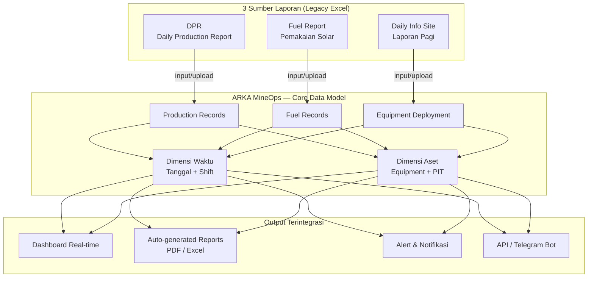

### 2.3 Arsitektur Teknis (High-Level)

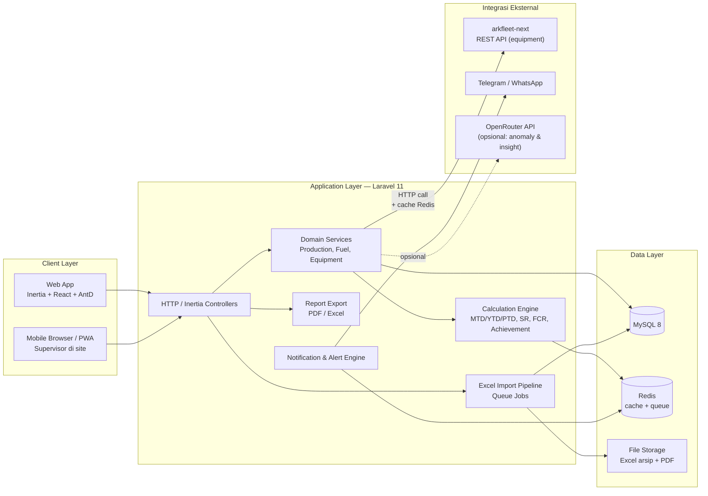

**Keputusan arsitektur kunci:**

1. **Calculation Engine terpusat** — MTD/YTD/PTD, Stripping Ratio, FCR, dan Achievement % dihitung di backend secara konsisten (tidak lagi tersebar di formula Excel yang rawan salah). Data mentah harian disimpan, agregat dihitung/di-cache.
2. **Import Pipeline berbasis Queue** — parsing Excel besar (778×156) jalan di background job agar UI tidak nge-hang.
3. **Data mentah vs. agregat dipisah** — tabel harian menyimpan angka aktual per hari; kolom MTD/YTD di Excel lama TIDAK disimpan mentah, melainkan diturunkan (derived) agar selalu konsisten.
4. **Equipment bukan data baru** — ARKA MineOps **tidak membuat ulang** master equipment. Data alat sudah ada & terkelola rapi di aplikasi **arkfleet-next** (fleet management existing PT. Arkananta), jadi MineOps **mengintegrasikan**, bukan mendupikasi. Lihat §2.4.
5. **Integrasi via REST API, bukan shared database** — ARKA MineOps dan arkfleet-next tetap **dua aplikasi independen**: masing-masing bisa di-*deploy* dan di-*scale* terpisah, tanpa *coupling* skema database satu sama lain. Komunikasi murni lewat HTTP/REST + caching. Lihat §2.4.
6. **Site sebagai first-class citizen** — aplikasi dirancang **enterprise-wide** untuk seluruh site PT. Arkananta, bukan hanya satu site. Setiap `daily_entries` sudah terikat ke `site_id`, dan pemilihan site adalah elemen utama navigasi UI (site selector di navbar/dashboard) — lihat §6.

### 2.4 Integrasi dengan arkfleet-next — Equipment Registry

**Temuan penting:** aplikasi **arkfleet-next** sudah punya master data equipment yang lengkap (~1.000 unit lintas project, tersebar di berbagai site — termasuk ~80+ unit khusus di Site 022C GPK) dengan kode unit (`E 071`, `DZ 040`, `ADT 009`, `T 112`, dll.) yang **persis sama** dengan kode unit yang dipakai di Excel Fuel Report & Daily Info Site. Tabel `arkfleet_next.equipment` bahkan sudah punya `equipment_hm_km_readings` untuk tracking HM/KM — kebutuhan yang tadinya dirancang sebagai tabel `equipment_readings` di §3.

**Keputusan:** ARKA MineOps **tidak membuat tabel `equipment` sendiri**. Equipment adalah *shared master data* — single source of truth ada di arkfleet-next, dan MineOps mengaksesnya **murni via REST API** (bukan membaca tabel database-nya langsung) untuk kebutuhan operasional (fuel, deployment, produksi per alat).

#### 2.4.1 Pendekatan Integrasi: REST API

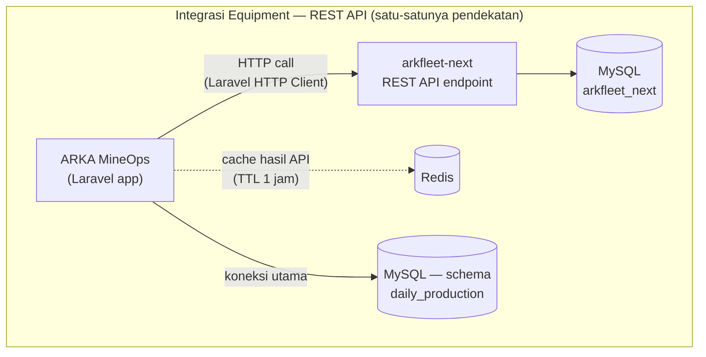

**Mengapa REST API, bukan shared database:**

| Aspek | Alasan memilih REST API |
|-------|--------------------------|
| Decoupling | Kedua aplikasi tidak saling terikat pada skema database masing-masing; perubahan struktur tabel di satu sisi tidak otomatis memecahkan yang lain. |
| Deploy & scale independen | ARKA MineOps dan arkfleet-next bisa di-*deploy*, di-*update*, dan di-*scale* terpisah, bahkan bisa dipindah ke server berbeda tanpa refactor besar. |
| Kontrak yang jelas | API endpoint menjadi *contract* yang eksplisit dan terdokumentasi (§9.6), lebih mudah diaudit dibanding akses tabel langsung. |
| Keamanan | Tidak perlu memberi akses database lintas aplikasi (kredensial DB terbatas hanya milik masing-masing app); akses cukup lewat token API. |
| Trade-off yang diterima | Ada network round-trip & perlu strategi caching — dimitigasi dengan Redis cache (TTL 1 jam) + fallback graceful degradation (lihat §9.6). |

#### 2.4.2 Prinsip Referensi & Caching Data

- Equipment di ARKA MineOps tetap direferensikan sebagai **`equipment_id` (foreign key reference)** ke `arkfleet_next.equipment.id` — tapi aplikasi **tidak join langsung** ke tabel arkfleet-next; `equipment_id` didapat & divalidasi lewat panggilan API.
- Untuk menghindari API call di setiap render dashboard, MineOps menyimpan **cache/denormalized copy** dari field equipment yang sering diakses (`unit_code`, `description`, `plant_type_name`) di tabel lokal. Ada dua strategi yang bisa dipakai (bisa dikombinasikan):
  1. **Sinkronisasi via event/webhook atau scheduled sync** — cache lokal di-refresh saat arkfleet-next mengirim webhook perubahan, atau via scheduled job berkala.
  2. **API call real-time + caching layer** — data equipment diambil live dari API, tapi hasilnya di-cache di Redis (TTL 1 jam) agar tidak membebani arkfleet-next di setiap request.
- Data **operasional** (shift assignment, produksi per alat, konsumsi fuel) tetap murni domain MineOps karena arkfleet-next tidak punya konteks ini.
- Data **HM/KM** (untuk kalkulasi FCR) diambil via endpoint `GET /api/equipment/{id}/hm-km-readings` dari arkfleet-next — MineOps tidak perlu bikin tabel readings sendiri lagi (lihat perubahan ERD di §3, detail endpoint di §9.6).
- Filtering equipment ke scope site tertentu dilakukan via query parameter `project_code` pada endpoint `GET /api/equipment` (mis. `project_code=022C`, `021C`, `017C`, dst.) — sesuai site yang sedang aktif dipilih user (§6).

---

## 3. Entity Relationship Diagram (ERD)

Model data dirancang agar ketiga laporan menyatu pada `equipment`, `site/pit`, `shift`, dan `production_date`.

> **Catatan integrasi (lihat §2.4):** `equipment` **tidak lagi dimodelkan sebagai tabel milik MineOps**. Master equipment (`arkfleet_next.equipment`) berada di aplikasi **arkfleet-next** — digambar di ERD sebagai kotak *external reference* (garis putus-putus) yang direferensikan oleh `FUEL_RECORDS` dan `EQUIPMENT_DEPLOYMENTS` via `equipment_id`, diakses **via REST API** (bukan shared DB — lihat §2.4). Tabel `EQUIPMENT_TYPES` dan `EQUIPMENT_READINGS` yang sebelumnya direncanakan **dihapus** dari skema MineOps karena setara `plant_types`/`equipment_hm_km_readings` sudah tersedia di arkfleet-next dan diambil via API.

```mermaid
erDiagram
    USERS ||--o{ DAILY_ENTRIES : creates
    ROLES ||--o{ USERS : has

    SITES ||--o{ PITS : contains
    PITS ||--o{ PRODUCTION_RECORDS : "produced at"

    ARKFLEET_EQUIPMENT ||..o{ FUEL_RECORDS : "references (external, via REST API)"
    ARKFLEET_EQUIPMENT ||..o{ EQUIPMENT_DEPLOYMENTS : "references (external, via REST API)"

    SHIFTS ||--o{ PRODUCTION_RECORDS : "measured in"
    SHIFTS ||--o{ FUEL_RECORDS : "measured in"
    SHIFTS ||--o{ EQUIPMENT_DEPLOYMENTS : "assigned in"

    DAILY_ENTRIES ||--o{ PRODUCTION_RECORDS : groups
    DAILY_ENTRIES ||--o{ FUEL_RECORDS : groups
    DAILY_ENTRIES ||--o{ EQUIPMENT_DEPLOYMENTS : groups
    DAILY_ENTRIES ||--|| SITE_INFO : "has weather/safety"

    MONTHLY_PLANS ||--o{ PLAN_TARGETS : contains
    PITS ||--o{ PLAN_TARGETS : "targeted for"

    FUEL_TYPES ||--o{ FUEL_RECORDS : "type of"
    FUEL_TYPES ||--o{ FUEL_PRICES : "priced by"
    FUEL_RECEIPTS ||--o{ FUEL_STOCK_MOVEMENTS : records

    USERS {
        bigint id PK
        string name
        string email
        bigint role_id FK
        boolean is_active
    }
    ROLES {
        bigint id PK
        string name "admin/supervisor/management/fuel_officer"
    }
    SITES {
        bigint id PK
        string code "022C/021C/017C/011C/dst — multi-site"
        string name "GPK/SBI/KPUC/Kitadin/dst (enterprise-wide)"
        string location "berbagai lokasi Kalimantan"
    }
    PITS {
        bigint id PK
        bigint site_id FK
        string code "PIT1/PIT2"
        string owner "GPK/ARKA"
    }
    ARKFLEET_EQUIPMENT {
        bigint id PK "external — via REST API arkfleet-next"
        string unit_code "E 071 (matches Excel codes)"
        string description "Excavator Hitachi EX1200-6"
        bigint unit_model_id FK "external"
        bigint plant_type_id FK "1 Digger/2 Hauler/3 Support/4 Heavy Equip"
        bigint asset_category_id FK "1 Mayor/2 Minor"
        bigint unitstatus_id FK "1 Active/2 Inactive/3 Scrap/4 Sold"
        string project_code FK "022C/021C/017C/dst — site/project code"
        boolean is_active
        boolean is_rfu
    }
    SHIFTS {
        bigint id PK
        string name "Day/Night"
        time start_time
        time end_time
    }
    DAILY_ENTRIES {
        bigint id PK
        date production_date
        bigint site_id FK
        bigint created_by FK
        string status "draft/submitted/approved"
        string source "manual/excel_import"
    }
    PRODUCTION_RECORDS {
        bigint id PK
        bigint daily_entry_id FK
        bigint pit_id FK
        bigint shift_id FK
        decimal ob_removal_bcm
        decimal coal_getting_ton
        decimal coal_hauling_ton
        string activity "OB/Coal/TopSoil/MUD/HighAshCoal"
        int truck_count
    }
    FUEL_RECORDS {
        bigint id PK
        bigint daily_entry_id FK
        bigint equipment_id FK "FK -> arkfleet_next.equipment.id"
        bigint shift_id FK
        bigint fuel_type_id FK
        decimal liters
        decimal working_hours
        string usage_category "WasteLoading/WasteHauling/Dewatering/General"
    }
    EQUIPMENT_DEPLOYMENTS {
        bigint id PK
        bigint daily_entry_id FK
        bigint equipment_id FK "FK -> arkfleet_next.equipment.id"
        bigint pit_id FK
        bigint shift_id FK
        decimal prod_ob_bcm
        decimal prod_coal_ton
        string operator_name
    }
    SITE_INFO {
        bigint id PK
        bigint daily_entry_id FK
        string weather
        decimal rain_hours
        decimal slippery_hours
        int manpower_plan
        int manpower_actual
        text safety_notes
        decimal fuel_stock_liters
    }
    MONTHLY_PLANS {
        bigint id PK
        bigint site_id FK
        int year
        int month
    }
    PLAN_TARGETS {
        bigint id PK
        bigint monthly_plan_id FK
        bigint pit_id FK
        string metric "OB/Coal/StrippingRatio"
        string owner "GPK/ARKA"
        decimal target_value
    }
    FUEL_TYPES {
        bigint id PK
        string name "Solar/Bio Solar"
    }
    FUEL_PRICES {
        bigint id PK
        bigint fuel_type_id FK
        decimal price_per_liter
        date effective_date
    }
    FUEL_RECEIPTS {
        bigint id PK
        date receipt_date
        decimal liters
        string gi_number "No GI"
        string supplier
    }
    FUEL_STOCK_MOVEMENTS {
        bigint id PK
        bigint fuel_receipt_id FK
        string type "in/out"
        decimal liters
        date movement_date
    }
```

### 3.1 Catatan Desain Tabel

- **`daily_entries` sebagai "header" harian** — satu record per (tanggal, site). Semua detail (produksi, fuel, deployment, info site) tergantung padanya. Ini yang menggantikan "satu file Excel per hari".
- **Agregat (MTD/YTD/PTD/Achievement) TIDAK disimpan sebagai kolom mentah** — dihitung on-the-fly oleh Calculation Engine + di-cache di Redis. Alternatif untuk performa: tabel `production_aggregates` (materialized summary) yang di-refresh saat data harian di-approve.
- **`equipment` bukan tabel MineOps** — `equipment_id` di `fuel_records` & `equipment_deployments` tetap FK reference ke `arkfleet_next.equipment.id` (lihat §2.4), tapi MineOps **tidak join langsung** ke tabel arkfleet-next. Sebagai gantinya, MineOps menyimpan **cache/denormalized copy** dari field yang sering diakses (`unit_code`, `description`, `plant_type_name`) di tabel lokal agar tidak perlu API call di setiap render dashboard. Sinkronisasi dilakukan via event/webhook atau scheduled sync — atau, alternatifnya, tetap API call real-time dengan caching layer (Redis, TTL 1 jam). Lihat §2.4.2 & §9.6.
- **HM/KM awal-akhir tidak perlu tabel `equipment_readings` sendiri** — sudah tersedia di `arkfleet_next.equipment_hm_km_readings`, diakses via endpoint `GET /api/equipment/{id}/hm-km-readings` (kolom `reading_date`, `reading_type` [hm/km], `reading_value`). MineOps mengambil data ini via API untuk kalkulasi FCR, bukan mencatat ulang atau membaca tabel-nya langsung.
- **Stripping Ratio** = `Σ OB (bcm) / Σ Coal (ton)` — metrik turunan, tidak disimpan mentah.
- **FCR (Fuel Consumption Ratio)** = liter fuel per satuan produksi (bcm/ton) atau per jam kerja — turunan dari `fuel_records` + `production_records`, dengan HM/KM diambil via API dari `arkfleet_next.equipment_hm_km_readings`.

---

## 4. Daftar Modul / Fitur

### Modul A — Master Data Management (`MO-Master`)
| Fitur | Deskripsi |
|-------|-----------|
| ~~Equipment Registry (CRUD)~~ → **Equipment Assignment** | **Tidak perlu dibuat dari nol.** Master unit (kode, tipe, model, ownership, status) sudah ada di **arkfleet-next**. Admin **search/filter equipment via REST API** dari arkfleet-next (per site — mis. ~80+ unit di Site 022C), hasil di-*cache*, lalu **assign ke PIT** & tandai sebagai *active for production tracking*. Lihat §2.4 & §9.6. |
| Site & PIT Config | Kelola **multiple site** (022C GPK, 021C SBI, 017C KPUC, 011C Kitadin, dst. — bukan cuma satu site) dan PIT per site (PIT1 GPK, PIT2 GPK, dst.), kepemilikan area. Admin bisa menambah/mengaktifkan site baru sesuai ekspansi operasional. |
| Shift Definition | Day/Night dengan jam mulai-selesai. |
| Fuel Type & Price | Jenis solar + histori harga per tanggal efektif (untuk kalkulasi biaya). |
| User & Role | Manajemen user + role-based access. |

> **Equipment Assignment (baru):** halaman untuk browse/search equipment via endpoint `GET /api/equipment` dari arkfleet-next (filter by `project_code` sesuai site aktif, `plant_type`, `unitstatus`), pilih unit yang relevan, lalu assign ke PIT + tandai aktif untuk tracking produksi/fuel harian. Saat unit dipilih, MineOps menyimpan `equipment_id` + cached fields (`unit_code`, `description`, `plant_type`) ke tabel lokal. Equipment baru yang ditambahkan admin fleet di arkfleet-next akan muncul di list ini setelah cache di-refresh (via webhook invalidation atau scheduled sync, TTL 1 jam — lihat §9.6) — admin MineOps kemudian meng-assign-nya ke PIT saat unit tersebut mulai beroperasi di site.

### Modul B — Daily Data Entry (`MO-Entry`)
| Fitur | Deskripsi |
|-------|-----------|
| Form Produksi Harian | Input OB Removal & Coal Getting per PIT per shift, truck count per aktivitas. |
| Form Fuel Usage | Input pemakaian solar per equipment per shift + kategori (Waste Loading/Hauling/Dewatering/General). |
| Form Info Site | Cuaca, rain & slippery hours, manpower, safety notes, fuel stock. |
| Form Equipment Deployment | Assignment alat per shift + produksi per alat (dari Daily Info Site). |
| **Excel Import** | Upload file DPR/Daily Info/Fuel → parse otomatis → preview → konfirmasi. Untuk migrasi & workflow transisi. |
| Draft & Submit Workflow | Simpan draft, submit, approve (supervisor → management). |

### Modul C — Dashboard & Analytics (`MO-Dashboard`)
| Fitur | Deskripsi |
|-------|-----------|
| Executive Dashboard | KPI hari ini: OB, Coal, SR, Fuel + MTD & Achievement vs Plan (gauge/progress). |
| Production Trend | Grafik tren OB, Coal, Stripping Ratio (harian/MTD/YTD). |
| Fuel Dashboard | Konsumsi per equipment, FCR trend, breakdown per kategori usage. |
| Equipment Utilization | Availability, working hours, produktivitas per alat. |
| Drill-down | Klik KPI → detail per PIT → per shift → per equipment. |

### Modul D — Plan vs Actual (`MO-Plan`)
| Fitur | Deskripsi |
|-------|-----------|
| Monthly Plan Input | Target OB/Coal/SR per PIT per bulan (Plan GPK & Plan ARKA). |
| Auto Achievement | Hitung Achievement % otomatis (Actual / Plan). |
| Variance Analysis | Analisis selisih plan vs actual, kontribusi rain/slippery terhadap loss. |

### Modul E — Reporting (`MO-Report`)
| Fitur | Deskripsi |
|-------|-----------|
| Auto-generate Daily Report | Rekap harian format resmi (mirip layout Excel lama) → PDF/Excel. |
| Custom Period Report | Report per rentang tanggal, per PIT, per equipment. |
| Export | PDF (untuk distribusi) & Excel (untuk yang masih butuh olah data). |
| Template resmi | Header dokumen ARKA/ENG/IV/12.01 dipertahankan agar familiar. |

### Modul F — Notification & Alert (`MO-Notify`)
| Fitur | Deskripsi |
|-------|-----------|
| Achievement Alert | Notif saat achievement < target (mis. < 90%). |
| Fuel Anomaly Alert | Deteksi konsumsi fuel abnormal per equipment (FCR outlier). |
| Daily Summary Bot | Auto-kirim ringkasan harian ke Telegram/WhatsApp grup manajemen. |
| Reminder | Ingatkan supervisor jika data harian belum diinput jam tertentu. |

### Modul G — AI Insight (opsional, `MO-AI` via OpenRouter)
| Fitur | Deskripsi |
|-------|-----------|
| Narrative Summary | Ringkasan naratif otomatis ("Produksi hari ini 95% target, tertahan hujan 2 jam di PIT2"). |
| Anomaly Explanation | Jelaskan lonjakan fuel/penurunan produksi. |
| Natural Language Query | "Berapa total OB PIT1 minggu ini?" → jawaban + grafik. |

---

## 5. UX Flow — User Journey

### 5.1 Flow Supervisor (Input Data Harian di Site)

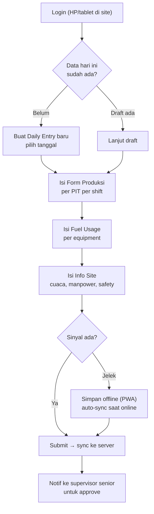

### 5.2 Flow Management (Lihat Dashboard)

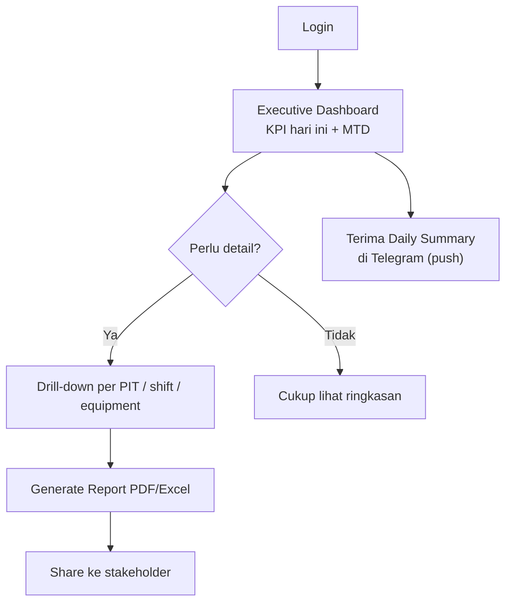

### 5.3 Flow Admin (Setup & Plan)

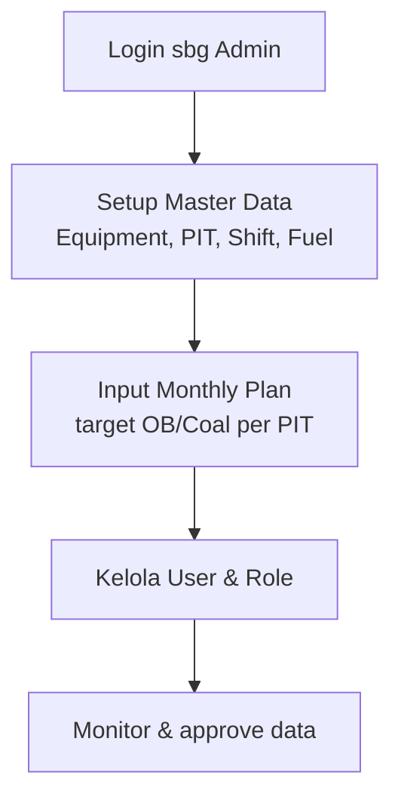

### 5.4 Flow Migrasi (Excel Import)

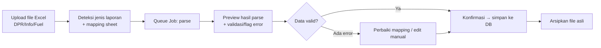

---

## 6. Wireframe Konsep

### 6.1 Executive Dashboard (Desktop)

```
┌──────────────────────────────────────────────────────────────────────┐
│  ARKA MineOps   Site: [022C GPK ▼]   📅 31 Mei 2026 ▼    🔔 3  👤 Budi │
│                  ┌──────────────────┐                                 │
│                  │ ✓ 022C GPK       │  ← site selector dropdown       │
│                  │   021C SBI       │     (semua site yang bisa       │
│                  │   017C KPUC      │     diakses user)               │
│                  │   011C Kitadin   │                                 │
│                  └──────────────────┘                                 │
├────────────┬─────────────────────────────────────────────────────────┤
│ ▤ Dashboard│  RINGKASAN HARI INI                    [Export ▼] [Report]│
│ ✎ Entry    │ ┌───────────┐┌───────────┐┌───────────┐┌───────────┐    │
│ ⛏ Produksi │ │ OB REMOVAL││COAL GETTING││ STRIPPING ││   FUEL    │    │
│ ⛽ Fuel     │ │ 45.230 Bcm││ 8.120 ton ││  RATIO    ││ 32.400 L  │    │
│ 🚜 Equipment│ │ ▲ 96% plan││ ▲ 92% plan││   5.57    ││ FCR 0.71  │    │
│ 📋 Plan     │ └───────────┘└───────────┘└───────────┘└───────────┘    │
│ 📊 Reports  │  ┌─────────────────────────┐┌──────────────────────┐   │
│ ⚙ Master    │  │ TREN OB & COAL (30 hari)││ ACHIEVEMENT MTD      │   │
│ 👥 Users    │  │   ╱╲    ╱╲___╱          ││  OB   ███████░░ 88%  │   │
│             │  │  ╱  ╲__╱                ││  Coal ██████░░░ 79%  │   │
│             │  │ (line chart)            ││  (gauge/progress)    │   │
│             │  └─────────────────────────┘└──────────────────────┘   │
│             │  ┌─────────────────────────┐┌──────────────────────┐   │
│             │  │ PRODUKSI PER PIT        ││ STATUS ALAT          │   │
│             │  │ PIT1 GPK  ██████ 24.1k  ││ ● Active     34      │   │
│             │  │ PIT2 GPK  ████   21.1k  ││ ● Breakdown   4      │   │
│             │  │ (bar chart)             ││ ● Standby     2      │   │
│             │  └─────────────────────────┘└──────────────────────┘   │
└────────────┴─────────────────────────────────────────────────────────┘
```

**Site selector sebagai first-class citizen:** dropdown site di navbar (022C, 021C, 017C, 011C, dst.) muncul di semua halaman utama, bukan hanya dashboard. Memilih site akan memfilter seluruh data (dashboard, entry, report, equipment assignment) ke site tersebut. User dengan akses multi-site bisa berpindah site tanpa logout ulang; daftar site yang muncul disesuaikan dengan hak akses (role) masing-masing user.

### 6.2 Form Daily Entry — Produksi (Desktop)

```
┌──────────────────────────────────────────────────────────────────────┐
│  Daily Entry — 31 Mei 2026            Status: DRAFT    [Simpan][Submit]│
├──────────────────────────────────────────────────────────────────────┤
│  [Produksi] [Fuel] [Equipment] [Info Site]        ← tab               │
├──────────────────────────────────────────────────────────────────────┤
│  OVER BURDEN REMOVAL (Bcm)                                             │
│  ┌────────┬──────────┬──────────┬──────────┬──────────┐               │
│  │  PIT   │ Day Shift│Night Shift│  Total   │ vs Plan  │               │
│  ├────────┼──────────┼──────────┼──────────┼──────────┤               │
│  │PIT1 GPK│ [12.500 ]│ [11.600 ]│  24.100  │  96% ▲   │               │
│  │PIT2 GPK│ [10.800 ]│ [10.330 ]│  21.130  │  94% ▲   │               │
│  └────────┴──────────┴──────────┴──────────┴──────────┘               │
│                                                                        │
│  COAL GETTING (ton)              TRUCK COUNT (per aktivitas)           │
│  ┌────────┬─────────┬─────────┐  ┌──────────────┬───────┐             │
│  │  PIT   │Day │Night│ Total  │  │ Overburden   │ [412] │             │
│  │PIT1    │[..]│[..] │ 4.100  │  │ Top Soil     │ [ 88] │             │
│  │PIT2    │[..]│[..] │ 4.020  │  │ Coal Hauling │ [156] │             │
│  └────────┴─────────┴─────────┘  │ MUD / HighAsh│ [...] │             │
│                                   └──────────────┴───────┘             │
│  ⚠ Auto-calc: MTD & YTD dihitung otomatis saat submit                 │
└──────────────────────────────────────────────────────────────────────┘
```

### 6.3 Mobile View — Supervisor (Input di Site)

```
┌─────────────────────┐   ┌─────────────────────┐
│ ☰  ARKA MineOps   🔔│   │ ← Fuel Entry        │
│ 📅 31 Mei · 022C    │   │ 31 Mei · Day Shift  │
├─────────────────────┤   ├─────────────────────┤
│ ⚡ Entry Hari Ini   │   │ 🔍 Cari equipment.. │
│ ┌─────────────────┐ │   │ ┌─────────────────┐ │
│ │ Produksi    ✓   │ │   │ │ E 071 Hitachi   │ │
│ │ Fuel        ●   │ │   │ │ Liter: [ 850  ] │ │
│ │ Equipment   ○   │ │   │ │ Jam:   [ 11.5 ] │ │
│ │ Info Site   ○   │ │   │ └─────────────────┘ │
│ └─────────────────┘ │   │ ┌─────────────────┐ │
│                     │   │ │ A 40 G          │ │
│ 📶 Offline mode     │   │ │ Liter: [ 420  ] │ │
│ 2 entry belum sync  │   │ │ Jam:   [ 10.0 ] │ │
│ [ Sync sekarang ]   │   │ └─────────────────┘ │
│                     │   │  + Tambah equipment │
│ [   Lanjut Isi  →]  │   │ [    Simpan Draft ] │
└─────────────────────┘   └─────────────────────┘
```

**Prinsip UX mobile:** form pendek per langkah, input numerik dengan keyboard angka, indikator offline yang jelas, tombol besar (sarung tangan/kondisi lapangan), dark-mode friendly untuk terik/malam.

---

## 7. Tech Stack Detail

### 7.1 Backend — Laravel 11+

| Kebutuhan | Package / Approach |
|-----------|-------------------|
| Framework | Laravel 11 (skeleton baru: `bootstrap/app.php`, tanpa Kernel.php) |
| Auth & Session | Laravel Breeze (Inertia+React starter) atau Fortify |
| Role & Permission | `spatie/laravel-permission` |
| Excel Import/Export | `maatwebsite/excel` (PhpSpreadsheet) — parsing DPR/Fuel besar |
| PDF Export | `barryvdh/laravel-dompdf` atau `spatie/laravel-pdf` (Browsershot untuk layout kompleks) |
| Queue | Redis + Laravel Horizon (monitor job import) |
| Cache | Redis (agregat MTD/YTD/FCR) |
| Notifications | Laravel Notifications + channel Telegram (`laravel-notification-channels/telegram`) |
| Query/Reporting | Eloquent + query builder; pertimbangkan DB views untuk agregat berat |
| API (mobile/bot) | Laravel Sanctum (token) untuk endpoint bot & PWA sync |
| Testing | Pest / PHPUnit + factories |
| Audit log | `owen-it/laravel-auditing` (jejak perubahan data operasional) |
| **Integrasi arkfleet-next (API)** | ARKA MineOps mengonsumsi **REST API** dari arkfleet-next (Laravel HTTP Client + cache Redis) untuk data master equipment — bukan shared database. Lihat §2.4 & §7.3.1. |

### 7.2 Frontend — Inertia + React + Ant Design

| Kebutuhan | Package / Approach |
|-----------|-------------------|
| Bridge | Inertia.js v2 (React adapter) |
| UI Kit | Ant Design 5 (`antd`) |
| Tabel data | AntD **ProTable** (`@ant-design/pro-components`) — filter, sort, export |
| Charts | `@ant-design/charts` (G2Plot) atau `recharts` untuk tren |
| Form | AntD Form + `ProForm` (validasi, dependent fields) |
| State/data | Inertia props + `@tanstack/react-query` untuk polling real-time ringan |
| Build | Vite (default Laravel 11) |
| Icons | `@ant-design/icons` |
| Date | `dayjs` (bawaan AntD) |

### 7.3 Database — MySQL 8

- InnoDB, utf8mb4.
- Index komposit pada `(production_date, site_id)`, `(equipment_id)`, `(daily_entry_id)`.
- Pertimbangkan **generated columns** atau **summary tables** untuk agregat yang sering dibaca.
- Partitioning per tahun untuk `fuel_records`/`production_records` bila data historis besar.

#### 7.3.1 Integrasi API dengan arkfleet-next

ARKA MineOps mengambil data master equipment dari arkfleet-next murni via **REST API** (lihat §2.4) — bukan shared database, agar kedua aplikasi tetap bisa *deploy* & *scale* independen tanpa *coupling* skema DB.

| Kebutuhan | Package / Approach |
|-----------|---------------------|
| HTTP Client | Laravel HTTP Client (`Illuminate\Support\Facades\Http`) — memanggil endpoint arkfleet-next (§9.6) |
| Caching | Redis — cache hasil `GET /api/equipment` (per `project_code`/`plant_type`), TTL 1 jam |
| Resiliency | *Retry* otomatis (mis. `Http::retry(3, 100)`) + *circuit breaker* sederhana — kalau API arkfleet-next gagal berkali-kali, fallback ke data cache terakhir (*graceful degradation*, lihat §9.6) |
| Auth antar-app | Token API (Sanctum personal access token atau API key khusus service-to-service), dikirim via header `Authorization: Bearer` |
| Sinkronisasi cache | Webhook dari arkfleet-next saat equipment diubah, **atau** scheduled job (`schedule:run`) untuk refresh cache equipment secara periodik |

- Data equipment yang diambil dari API bersifat **read-only** di sisi MineOps — fleet lifecycle (tambah unit, ubah status, dsb.) tetap jadi tanggung jawab arkfleet-next.
- MineOps menyimpan **cached fields** (`equipment_id`, `unit_code`, `description`, `plant_type`) di tabel lokal (`fuel_records`, `equipment_deployments`) untuk menghindari API call berulang saat render dashboard/report — lihat §3.1 & §9.6.
- Kredensial/token API sebaiknya dibuat dengan scope terbatas (read-only pada endpoint equipment) agar MineOps tidak bisa mengubah data fleet.

### 7.4 Real-time & Offline

| Kebutuhan | Approach |
|-----------|----------|
| Real-time dashboard | Polling ringan via react-query (interval) — cukup untuk update harian. Upgrade ke Laravel Reverb (WebSocket) jika perlu live. |
| Offline (site sinyal jelek) | **PWA** (service worker) + IndexedDB untuk simpan draft entry lokal; sync queue saat online. |
| Mobile | Responsive AntD + PWA installable (add to home screen). Tidak perlu app native di fase awal. |

### 7.5 Deployment — Ubuntu VPS + Tailscale

- Nginx + PHP-FPM 8.3, MySQL 8, Redis.
- Tailscale untuk akses privat aman (dashboard tidak perlu expose publik; akses via tailnet).
- Supervisor/systemd untuk `queue:work` & Horizon.
- Deploy: Git + Deployer/`laravel envoy` atau GitHub Actions.
- Backup harian DB + file arsip Excel.

### 7.6 AI (opsional) — OpenRouter

> **Catatan:** ini adalah integrasi API yang **berbeda** dari integrasi equipment arkfleet-next (§7.3.1 & §9.6). OpenRouter adalah layanan AI pihak ketiga untuk fitur naratif/insight (Modul G), bukan bagian dari integrasi data equipment.

- Panggil via HTTP client Laravel (`Http::withToken(...)`).
- Use case: narrative summary harian, anomaly explanation, natural-language query → SQL/agregat.
- Simpan API key di `.env`, panggil dari queue job (jangan blok request).

---

## 8. Fase Implementasi

> Estimasi berbasis 1–2 developer. Anggap 1 "minggu" = 5 hari kerja.

### Fase 0 — Discovery & Setup (1 minggu)
- Finalisasi mapping kolom Excel (DPR 156 kolom, Fuel 39 sheet) → skema DB.
- Setup repo, Laravel 11 + Inertia + React + AntD, CI, VPS + Tailscale.
- **Deliverable:** skeleton app jalan + auth login.

### Fase 1 — Master Data & Foundation (1.5 minggu)
- Modul Master (Site/PIT multi-site, Shift, Fuel Type/Price).
- Setup integrasi **REST API** ke arkfleet-next (Laravel HTTP Client + cache Redis, lihat §7.3.1) + service `EquipmentApiService` + halaman **Equipment Assignment** (§4).
- Role & permission (4 role), termasuk akses per site.
- **Deliverable:** admin bisa kelola semua master data multi-site & assign equipment existing dari arkfleet-next (via API) ke PIT.

### Fase 2 — Daily Data Entry (2 minggu)
- Form Produksi, Fuel, Equipment Deployment, Info Site.
- Draft/Submit/Approve workflow.
- Calculation Engine (MTD/YTD/PTD, SR, FCR, Achievement).
- **Deliverable:** input harian penuh manual bekerja end-to-end.

### Fase 3 — Dashboard & Reporting (2 minggu)
- Executive dashboard + charts (OB/Coal/SR/Fuel trend).
- Fuel dashboard & equipment utilization.
- Auto-generate report PDF/Excel (template resmi).
- **Deliverable:** manajemen bisa lihat real-time + export report.

### Fase 4 — Plan vs Actual & Excel Import (2 minggu)
- Monthly plan input + achievement auto-calc + variance.
- Excel Import pipeline (DPR/Info/Fuel) dengan preview & validasi → **kunci migrasi data historis**.
- **Deliverable:** plan tracking + migrasi file lama.

### Fase 5 — Mobile/PWA & Offline (1.5 minggu)
- Responsive polish + PWA + offline draft & sync.
- **Deliverable:** supervisor input dari HP di site meski sinyal jelek.

### Fase 6 — Notification & AI (1.5 minggu)
- Alert achievement & fuel anomaly.
- Telegram daily summary bot.
- (Opsional) AI narrative & NL query via OpenRouter.
- **Deliverable:** notifikasi otomatis + insight.

### Fase 7 — UAT, Hardening & Rollout (1 minggu)
- User acceptance test dengan supervisor & fuel officer, **dilakukan di beberapa site** (mis. 022C dan minimal satu site lain) untuk memvalidasi desain multi-site & integrasi API sebelum rollout penuh.
- Import data historis batch, training user, cutover dari email.
- **Deliverable:** go-live.

**Total estimasi:** ± **12–13 minggu** (± 3 bulan) untuk versi lengkap. **MVP** (Fase 0–3) bisa dikejar dalam **±6–7 minggu**.

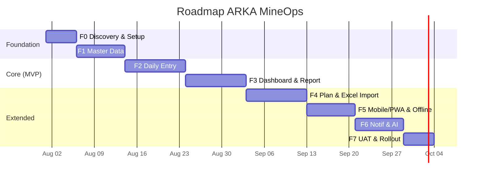

---

## 9. Pertimbangan Khusus

### 9.1 Handling Data Historis (ratusan file Excel existing)

**Tantangan:** Excel lama tidak konsisten (merged cells, formula, layout berubah antar bulan).

**Strategi:**
1. **Import bertahap, bukan sekaligus** — mulai dari 1-2 bulan terakhir untuk validasi mapping, baru mundur ke belakang.
2. **Mapping profile per template** — buat definisi mapping (kolom → field) yang bisa disesuaikan, karena layout bisa beda antar periode.
3. **Preview + human-in-the-loop** — hasil parse selalu ditampilkan untuk dikonfirmasi/koreksi sebelum commit ke DB. Flag baris yang mencurigakan (nilai kosong/anomali).
4. **Arsip file asli** — simpan Excel original (link ke `daily_entries.source_file`) untuk audit/traceability.
5. **Rekonsiliasi** — bandingkan agregat MTD hasil sistem vs angka MTD di Excel lama sebagai QA.
6. **Prioritas:** data agregat/summary lebih penting daripada setiap detail truck count historis. Bisa import summary dulu, detail belakangan (atau skip untuk periode sangat lama).

### 9.2 Strategi Migrasi dari Email → Aplikasi

**Pendekatan paralel (dual-run), bukan big-bang:**

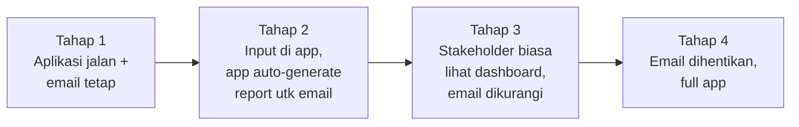

- **Tahap transisi kunci:** aplikasi meng-*generate* report berformat Excel/PDF yang **mirip file lama**, sehingga app bisa "menggantikan" pembuat email tanpa mengubah kebiasaan penerima dulu.
- **Change management:** training singkat per role, dampingi supervisor 1-2 minggu pertama.
- **Insentif:** tunjukkan bahwa input di app **lebih cepat** (tidak perlu rumus manual, auto-hitung MTD) — itu daya tarik adopsi.
- **Cutover** hanya setelah data konsisten & user nyaman.

### 9.3 Mobile-Friendly (supervisor pakai HP di site)

- **Responsive-first** untuk form entry; dashboard boleh dioptimalkan desktop tapi tetap terbaca di HP.
- **PWA installable** — "Add to Home Screen", buka seperti app.
- Input dioptimalkan: keyboard numerik, dropdown equipment dengan search, step-by-step wizard (bukan form panjang).
- Tombol besar, kontras tinggi (kondisi outdoor terik).
- Kompresi payload (data harian ringan) agar hemat kuota.

### 9.4 Offline Capability (sinyal jelek di site)

- **Service Worker + IndexedDB:** draft entry disimpan lokal, jalan tanpa internet.
- **Sync queue:** saat online, kirim antrian ke server; tangani konflik (last-write atau merge per field).
- **Indikator status jelas:** "📶 Offline — 2 entry belum sync" + tombol manual sync.
- **Idempotent submit:** pakai client-generated UUID agar submit ganda (akibat retry) tidak menduplikasi data.
- **Batasan realistis:** dashboard analitik butuh online; yang wajib offline adalah **data entry**, bukan lihat agregat.

### 9.5 Pertimbangan Lain

- **Konsistensi angka = nilai jual utama.** Selama ini tiap Excel bisa beda formula. Calculation Engine terpusat menjamin OB/Coal/SR/FCR dihitung dengan cara yang sama untuk semua.
- **Audit trail** — data operasional sering jadi dasar klaim/tagihan; catat siapa input/ubah apa.
- **Data ownership GPK vs ARKA** — bedakan Plan/Actual milik GPK dan ARKA (sudah tercermin di kolom `owner`).
- **Keamanan** — akses via Tailscale (privat), role-based, tidak expose ke publik di fase awal.
- **Skalabilitas** — desain sudah multi-site (`sites` table) sejak awal; ARKA MineOps ditujukan enterprise-wide untuk seluruh site PT. Arkananta (022C, 021C, 017C, 011C, dst.), bukan hanya satu site, memudahkan penambahan site baru nanti tanpa perubahan skema.

### 9.6 Integrasi Equipment via REST API

**Prinsip: clean separation of concerns, single source of truth untuk equipment, diakses murni via REST API — tidak ada shared database antara kedua aplikasi.**

#### 9.6.1 Endpoint yang Perlu Disediakan arkfleet-next

arkfleet-next perlu men-*expose* endpoint API berikut agar bisa dikonsumsi ARKA MineOps:

| Endpoint | Deskripsi |
|----------|-----------|
| `GET /api/equipment` | List equipment, dengan filter `project_code` (site), `plant_type`, `is_active` — dipakai untuk Equipment Assignment (§4) & search di form entry |
| `GET /api/equipment/{id}` | Detail satu equipment (unit_code, description, plant_type, status, dst.) |
| `GET /api/equipment/{id}/hm-km-readings` | History HM/KM readings equipment tersebut — dipakai untuk kalkulasi FCR (§3.1) |

#### 9.6.2 Arsitektur Konsumsi & Multi-Site

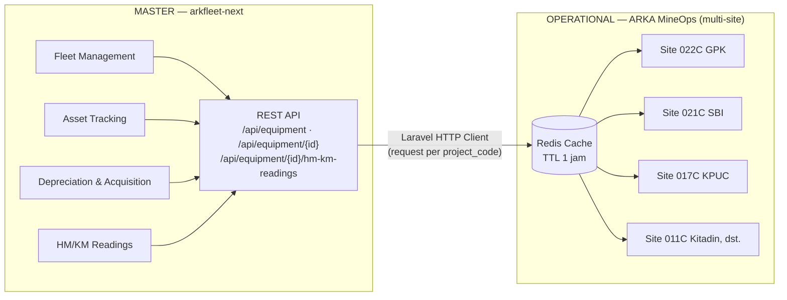

Beberapa site mengakses **data equipment yang sama** dari arkfleet-next melalui API yang sama, masing-masing memfilter dengan `project_code` sesuai site aktif (§2.4.2). Cache Redis dipakai bersama sehingga equipment yang sudah pernah di-fetch untuk satu site tidak perlu di-*request* ulang selama TTL belum habis.

| | arkfleet-next | ARKA MineOps |
|---|---------------|---------------|
| **Peran** | **Master** — fleet management, asset tracking, depreciation, HM/KM readings | **Operational** — daily production, fuel, deployment per shift, multi-site |
| **Kepemilikan data equipment** | Sumber kebenaran tunggal (single source of truth) | Hanya mereferensikan via `equipment_id` + cached fields, tidak mengakses tabel arkfleet-next langsung |
| **CRUD equipment** | Ya — tambah/ubah/hapus unit, ubah status, dsb. | Tidak — read-only via API, hanya assign ke PIT |
| **Cara akses** | — | Laravel HTTP Client → REST API → cache Redis (TTL 1 jam) |

#### 9.6.3 Caching Strategy

- Equipment list & detail di-**cache di Redis** (TTL 1 jam) per kombinasi filter (`project_code`, `plant_type`, `is_active`) agar tidak membebani arkfleet-next dengan request berulang.
- **Invalidasi cache** dilakukan via:
  1. **Webhook** dari arkfleet-next saat equipment ditambah/diubah/dihapus — MineOps langsung refresh cache terkait, atau
  2. **Scheduled refresh** (Laravel Scheduler) yang menarik ulang data equipment secara periodik sebagai *safety net* jika webhook gagal terkirim.

#### 9.6.4 Fallback — Graceful Degradation

- Jika API arkfleet-next **down atau timeout**, MineOps **tidak boleh gagal total** — tampilkan data dari cache terakhir yang masih tersimpan (walau sudah lewat TTL) dan tampilkan **warning** ke user (mis. "Data equipment mungkin tidak terkini, koneksi ke arkfleet-next terganggu").
- Fitur yang butuh data *real-time* equipment (mis. Equipment Assignment untuk unit baru) akan menunjukkan pesan error yang jelas, tapi fitur yang hanya butuh data cache (dashboard, fuel entry ke equipment yang sudah pernah diakses) tetap bisa berjalan.
- Implementasi teknis: `Http::retry(3, 100)` + `try/catch` di service layer, fallback ke `Cache::get()` tanpa melempar exception ke user.

#### 9.6.5 Equipment Selection & Local Cache

Alur saat user memilih equipment di MineOps (Equipment Assignment maupun form entry):

1. User **search** equipment dari API (`GET /api/equipment?project_code=...&search=...`), hasil diambil dari cache Redis bila tersedia.
2. User **pilih** unit yang relevan.
3. MineOps menyimpan `equipment_id` **beserta cached fields** (`unit_code`, `description`, `plant_type`) di tabel lokal (`fuel_records`, `equipment_deployments`) — sehingga render dashboard/report berikutnya **tidak perlu API call ulang**, cukup baca kolom lokal.

**Manfaat pendekatan ini:**
- **No data duplication di source-of-truth** — unit_code, model, status, dst. tetap hanya dikelola satu tempat (arkfleet-next); MineOps hanya menyimpan *cached copy* untuk performa, bukan sebagai sumber kebenaran baru.
- **Decoupled & independen** — ARKA MineOps dan arkfleet-next bisa di-*deploy*/*scale* terpisah, tanpa *coupling* skema database (lihat §2.4.1).
- **Fleet lifecycle** (akuisisi, penjualan, scrap) tetap sepenuhnya dikelola tim fleet di arkfleet-next — MineOps tidak perlu tahu/terlibat proses ini, cukup filter equipment yang `is_active`/`unitstatus = ACTIVE` saat assignment.
- **Skala multi-site** — pendekatan API + cache yang sama berlaku untuk semua site (022C, 021C, 017C, 011C, dst.), tidak perlu integrasi khusus per site.

---

## Ringkasan Eksekutif

**ARKA MineOps** mengubah 3 laporan Excel terpisah (DPR, Daily Info Site, Fuel Report) yang dikirim manual via email menjadi **satu dashboard terintegrasi real-time**, dirancang **enterprise-wide untuk seluruh site PT. Arkananta** (022C GPK, 021C SBI, 017C KPUC, 011C Kitadin, dan site lain) — bukan hanya satu site tunggal. Kuncinya: menyatukan ketiga laporan pada poros **waktu (tanggal+shift)** dan **aset (equipment+PIT)**, dengan **Calculation Engine terpusat** yang menjamin angka MTD/YTD/SR/FCR/Achievement selalu konsisten di semua site, dan **site selection sebagai first-class citizen** di UI (site selector di navbar/dashboard).

Penting: ARKA MineOps **tidak membangun ulang master data equipment**. Aplikasi ini memanfaatkan registry equipment yang sudah ada di **arkfleet-next** (± 1.000 unit lintas site, kode unit persis sama dengan Excel lama, termasuk HM/KM readings) melalui **REST API** — bukan shared database, agar kedua aplikasi tetap *decoupled*, bisa di-*deploy* & di-*scale* independen, tanpa *coupling* skema. MineOps mereferensikan `equipment_id` dan menyimpan *cached copy* field yang sering diakses (dengan caching layer Redis, TTL 1 jam, plus fallback *graceful degradation*) untuk performa, sambil menjaga single source of truth untuk data alat berat tetap di arkfleet-next.

Pendekatan implementasi: **MVP 6-7 minggu** (master data multi-site + entry + dashboard), lalu extend ke plan tracking, Excel import (migrasi), PWA offline, dan notifikasi/AI. Testing dilakukan di beberapa site untuk memvalidasi desain multi-site. Migrasi dilakukan **paralel (dual-run)** agar transisi dari kebiasaan email berjalan mulus.

*Dokumen ini adalah konsep awal untuk didiskusikan sebelum masuk fase teknis/coding.*
